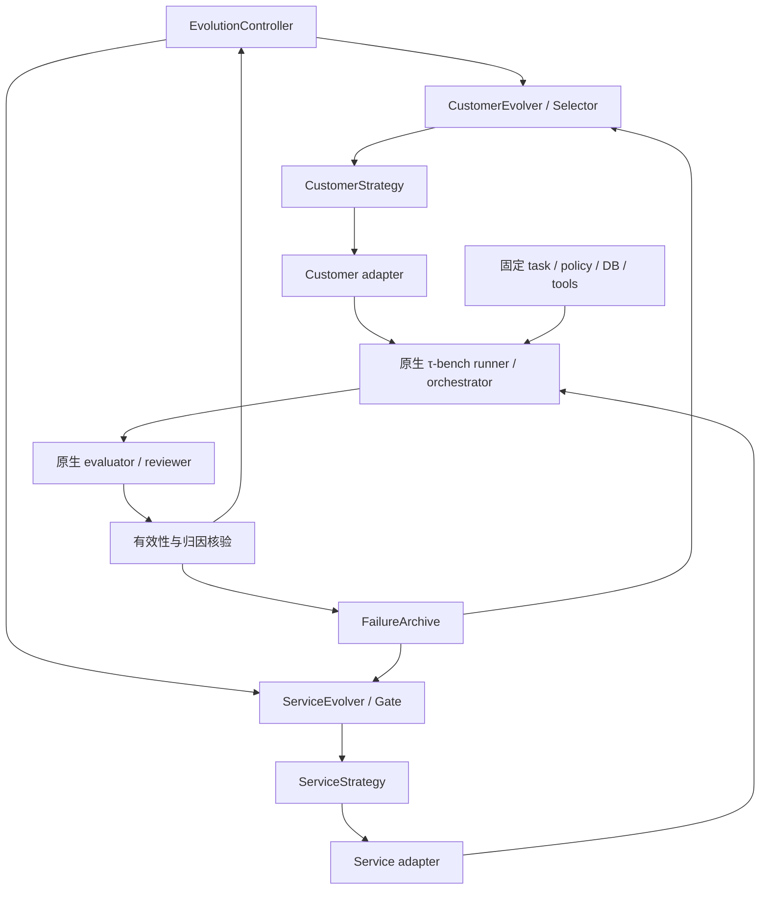

Status: Phase 0 guarded native runner, pinned environment/orchestrator construction, and stubbed native end-to-end episode/evaluation/reviewer verified; the complete Phase 0 → two-generation native Phase 3 artifact/checkpoint/budget handoff also passes with deterministic local completion stubs; Phase 1–3 offline mechanism layer, native Phase 3 adapter, concrete budget-gated ServiceTransition, repeated-write audit gate, strategy-level failure reproduction, balanced cross-play, RQ1/RQ2/RQ3 run-level JSON analyses, RQ3 matrix-bound evidence loading, Formal preregistration preflight and seed-block inferential analysis, Pilot paired-test power calculator with result-to-plan verification, exact-policy failure taxonomy, attribution-calibration CLI, multi-task E/V/H leakage validator, complete Service repair audit journaling, and initial-S0 clean-success gate implemented; provider-backed Phase 0 episodes and Pilot/Formal research not run
Owner: hjy8848
Last verified: 2026-09-29 (122 tests pass with all four pinned-runtime integration tests enabled; fetched τ-bench commit b7ea9074c1cba482b30687fecdb5c8425fd6f619 and verified all 19 source blob fingerprints; Phase 0/3 task eligibility preflights pass directly against the pinned Retail tasks/split files; Ruff, compileall, and diff checks pass; RQ2 and RQ3 run-level analysis CLIs and Formal seed-block inference are covered; Formal preregistration validates the exact primary family, local artifact hashes, Pilot-derived ordered paired differences, frozen power inputs, and calculation agreement including registered permutation settings; paired-t and paired-sign-flip power planning are covered for null-adjusted alternatives and Monte Carlo uncertainty; raw cross-play matrices are retained and summaries are recomputed on load; inconclusive responses retain missing denominators and independent blocks cannot reuse task/episode seeds; S₀ clean-success gate retains its source episode references; no provider-backed research episode has been run)
Scope: Research and engineering plan for EvoTau's τ-bench Retail text MVP and later evaluation.

This plan guides the decision to build EvoTau as a thin research layer and defines the Phase 0 integration proof before larger co-evolution experiments.

---
# EvoTau：基于 τ-bench 的闭环 Customer–Service Co-Evolution 研究与工程规划

**版本：v1.0（修订整合版）**

> 本文基于 6Astra 的源码审计与初版规划整理，并做了四项关键修订：
> 1. 严格分离 **工程正确性（Engineering PASS）** 与 **研究结果是否为正（Research Evidence）**；
> 2. 首次两代 co-evolution smoke 缩小为机制验证，不承担统计证明；
> 3. 强化 `ServiceStrategy` 是结构化执行规则、prompt 只是渲染载体的边界；
> 4. 明确“没有发生 replacement / repair / counter-adaptation”可以是合法研究结果，不能为了 PASS 放宽规则。

---

**建议把 EvoTau 做成 τ-bench 上的薄研究层：保留原生环境、工具、对话运行和任务评分，只新增策略演化、失败归因、历史回放与接受门控。MVP 从 Retail 文本模式开始，不 fork runtime。**

这一路线有源码支持，但需要修正三个前提：

1. **固定 backend state 应指固定初始状态与状态转移语义**，不是禁止 episode 内通过工具改变状态。
2. **原生 task failure 不能直接作为 Customer 的成功奖励**；必须先验证 Customer 合法性，再确认具体 Service 执行错误。
3. **每代参与 repair 接受决策的数据属于 validation，不再是严格 heldout。**最终测试集必须封存。

初始规划阶段仅进行了资料和源码读取。Phase 0 的本地实现情况记录在本文末尾；未创建远端仓库，也未调用模型实验 API。

下文使用三种证据标签：

- **[源码确认]**：直接检查实现或数据。
- **[架构推断]**：由已检查实现推导，仍需 integration smoke 验证。
- **[设计建议]**：EvoTau 的拟议规范，不是 τ-bench 已有能力。

检查基线为：

| 来源 | 本次固定版本 |
|---|---|
| `sierra-research/tau2-bench` | `b7ea9074c1cba482b30687fecdb5c8425fd6f619` |
| `IBM/CRAFT` | `01ab049ef3a27f51205686a1c419ea75bbed0b27` |

当前主仓库已使用 τ³-bench 名称，但核心 Python package 仍为 `tau2`。后续论文应准确报告“基于该 commit 的 τ-bench Retail”，不能将当前数据上的结果直接称为原始 τ²-bench 论文设置的复现。[当前仓库说明](https://github.com/sierra-research/tau2-bench/blob/b7ea9074c1cba482b30687fecdb5c8425fd6f619/README.md)

---

**1. Executive summary**

[设计建议] EvoTau 的最小研究单位是一个**可验证的攻防响应链**：

```text
合法 Customer 策略暴露具体执行错误
→ 最小 Service repair
→ 当前攻击效果下降，正常任务能力保留
→ Customer 针对新 Service 产生更有效的合法策略
```

推荐的主要决策如下：

| 问题 | 推荐 |
|---|---|
| 首个 domain | Retail |
| 交互模式 | 原生 text / half-duplex |
| 模型参数 | 固定，不做权重训练 |
| Customer 表示 | 4 个有限取值字段 |
| Customer mutation | 3 类算子，无 crossover |
| Customer fitness | 当前 Service 上，可复现且可归因的失败覆盖数 |
| Novelty | 记录、入 archive；MVP 不覆盖严格 selection |
| Service 表示 | 有 policy 引用的结构化执行规则；**规则是策略本体，prompt 只是渲染载体** |
| Failure attribution | 原生 evaluator + 原生 reviewer + 少量证据核验 |
| 历史回放 | 保存策略，重新运行交互 |
| Service gate | target、historical、clean validation、adversarial validation |
| 最终 heldout | 不参与逐代接受决策 |
| Fresh adversary | MVP 不加入在线生成器 |
| 更新顺序 | 每代 Customer-first，再 Service |
| 首次闭环 | 2 generations，仅证明机制，不证明长期 arms race |

最大的研究不确定性不是 adapter 能否接通，而是：**受约束的 Customer 行为变化，能否稳定暴露足够多可归因、可修复的执行错误。**

---

**2. Research hypothesis**

[设计建议] 将研究假设拆成三个可否证命题。

**H1：交互策略具有攻击价值。**  
固定任务、工具、政策、初始状态和 Service 后，Customer 的披露、请求排序和有限追问会改变执行轨迹，并提高有效失败发现率。

**H2：失败证据具有修复价值。**  
针对具体错误生成的执行规则，能降低该错误及相关错误的发生率，同时保留正常任务能力。

**H3：双方适应存在关联。**  
Service repair 改变哪些 Customer 策略有效；Customer 随后产生的改进依赖新的 Service，而不只是随搜索预算增加发现一般性强攻击。

H1、H2 成立并不自动推出 H3。EvoTau 应允许得出“有效的攻击搜索与修复系统，但未形成 arms race”的结果。

---

### 2.1 Engineering correctness 与 research outcome 必须分离

[设计建议] EvoTau 从第一天起使用两套完全独立的状态判断。

**Engineering status** 只回答：系统是否按照预先定义的协议正确执行。典型状态：

```text
PASS
FAIL
INCONCLUSIVE
```

例如：候选生成、执行、归因、selection 全部正常完成，即使所有候选都没有超过 incumbent，Customer-evolution 软件仍然可以是 `PASS`。

**Research outcome** 只回答：预先定义的研究现象是否被观察到。典型状态：

```text
SUPPORTED
NOT_OBSERVED
INCONCLUSIVE
```

因此以下结果都必须被允许：

```text
Engineering PASS + no Customer replacement
Engineering PASS + no accepted Service repair
Engineering PASS + no counter-adaptation
```

它们属于潜在的 negative result，而不是工程失败。只有协议执行错误、证据污染、预算中断导致无法判断等情况，才能把软件阶段判为失败或 inconclusive。

**禁止为了让某个 Phase “通过”而要求实验必须产生正向 evolution event。** 是否继续投入由预先定义的 pilot/kill criteria 决定，而不是通过修改 selection、fitness 或 gate 强行制造成功。

---

**3. Core invariants**

[设计建议] 每个实验建立不可变 manifest，冻结以下项目：

| 冻结项 | 精确定义 |
|---|---|
| Task truth | 原始 scenario、目标、偏好、已知/未知信息、条件分支 |
| Policy | 原文及其 hash |
| Environment | domain 实现、基础 DB、任务初始化数据与初始化动作 |
| Tools | 定义、实现、参数语义和状态转移 |
| Evaluation | task criteria、`reward_basis`、evaluation mode、judge 配置、归因规则版本 |
| Model configuration | 各角色模型、采样参数、上下文预算 |
| Experimental protocol | split、mutation 空间、selection、gate、预算和停止规则 |

需要额外冻结四条信息边界：

- Service runtime 不接收 task reference actions、评价答案、Customer 隐藏策略或用户尚未披露的事实。
- Customer runtime 不接收隐藏 DB、评价答案或 Service 的内部状态。
- Evolver 可以读取 evolution 数据的失败证据；生成的通用策略不能夹带用户 ID、订单 ID 或参考答案。
- Validation、heldout 的轨迹不能进入 mutation/repair prompt。

**固定事实不等于固定完整对话。**工具产生的合法状态变化、用户通过对话获知的信息都允许变化，但不能反向改写初始事实。

---

**4. System architecture**

[源码确认] 当前 runner 分为实例构建、simulation 执行、batch 执行三层。`run_simulation` 接收已构造的 orchestrator；`build_orchestrator` 接收 config 和 task，并在内部构造组件。它不是直接接收自定义 agent/user 实例的装配函数。[构建实现](https://github.com/sierra-research/tau2-bench/blob/b7ea9074c1cba482b30687fecdb5c8425fd6f619/src/tau2/runner/build.py)、[执行实现](https://github.com/sierra-research/tau2-bench/blob/b7ea9074c1cba482b30687fecdb5c8425fd6f619/src/tau2/runner/simulation.py)

[设计建议] EvoTau 的依赖方向如下：



EvoTau 不新增对话调度器、工具执行器或另一套 task reward。

**接入分两步：**

- Phase 0：直接构造两个 adapter 与原生 `Orchestrator`，调用 `run_simulation`。
- 之后：通过 registry 注册绑定不可变策略的 user class 和 agent factory，复用 `run_tasks`。

[架构推断] registry 支持这条路径，但 user 注册对象必须是 class；不能把一个普通 closure 当 user factory 传入。MVP 使用本地进程、`workers=0`，每个 batch 绑定一对固定策略，避免跨进程注册和可变全局策略污染。

---

**5. τ-bench integration map 与源码结论**

| Component | 已检查的 τ-bench 实现 | EvoTau action |
|---|---|---|
| Task/scenario loader | `runner/helpers.py`、domain `environment.py` | REUSE |
| Domain policy | domain `policy.md`、`Environment.get_policy()` | REUSE |
| Backend/environment | `environment/environment.py`、Retail DB | REUSE |
| Tools | `domains/retail/tools.py` | REUSE |
| User simulation loop | `UserSimulator.generate_next_message` | REUSE |
| User prompt composition | `UserSimulator.system_prompt` | OVERRIDE |
| Agent generation loop | `LLMAgent.generate_next_message` | REUSE |
| Agent prompt composition | `LLMAgent.system_prompt` | OVERRIDE |
| Orchestrator | `orchestrator/orchestrator.py` | REUSE |
| Instance construction | `runner/build.py`、registry | WRAP |
| Simulation execution | `runner/simulation.py` | REUSE |
| Native evaluation | `evaluator/evaluator.py` | REUSE |
| Conversation review | `reviewer.py`、`review_llm_judge.py` | WRAP |
| Attribution/adherence | 原生信号不足以直接完成 | ADD |
| Raw trajectory/logging | `SimulationRun`、batch logging | REUSE |
| Episode checkpoint | `runner/checkpoint.py` | WRAP |
| Batch/concurrency/retries | `runner/batch.py`、`progress.py` | REUSE |
| Evolution checkpoint | 没有对应机制 | ADD |
| Strategy/evolution/archive | 没有对应机制 | ADD |
| 全角色请求总预算 | 未见覆盖整个演化运行的原生硬上限 | ADD |

这里的 **OVERRIDE 仅指 EvoTau 子类覆盖 prompt property**，不修改 upstream 文件。

必须写入实现计划的源码发现：

1. **原生评分区分“执行哪些检查”和“哪些检查影响 reward”。**  
   `ALL` 会计算若干诊断结果，但最终只按 task 的 `reward_basis` 合成分数。不能把所有诊断失败都升级为任务失败。

2. **实际 Retail 数据与文档概述不同。**  
   本次固定版本共 114 tasks：112 个配置 `DB + NL_ASSERTION`，2 个仅 `DB`；其中 40 个 task 有非空 NL assertions。空 assertions 会直接返回通过。不能假定 Retail 完全无 judge 调用。[实际任务数据](https://github.com/sierra-research/tau2-bench/blob/b7ea9074c1cba482b30687fecdb5c8425fd6f619/data/tau2/domains/retail/tasks.json)、[NL evaluator](https://github.com/sierra-research/tau2-bench/blob/b7ea9074c1cba482b30687fecdb5c8425fd6f619/src/tau2/evaluator/evaluator_nl_assertions.py)

3. **当前 `run_tasks` 源码默认 `ALL`。**  
   runner 文档写的是 `ALL_WITH_NL_ASSERTIONS`。实现必须显式传入 evaluation mode。[batch 源码](https://github.com/sierra-research/tau2-bench/blob/b7ea9074c1cba482b30687fecdb5c8425fd6f619/src/tau2/runner/batch.py)

4. **低层 `run_simulation` 不附送 batch checkpoint/retry。**  
   直接调用实例 API 时，不能声称自动继承第三层功能。

5. **原生 auto-resume 不满足 EvoTau 的严格实验隔离。**  
   checkpoint 使用 task/trial/seed 识别已完成项；配置变化时 auto-resume 可以继续，并且配置比较排除了 policy。EvoTau 必须先验证完整 manifest hash，且不同策略使用不同 batch 路径。[checkpoint 源码](https://github.com/sierra-research/tau2-bench/blob/b7ea9074c1cba482b30687fecdb5c8425fd6f619/src/tau2/runner/checkpoint.py)

---

**6. CustomerStrategy design 与注入方式**

[设计建议] MVP 只保留四个行为字段，元数据另计：

| 字段 | 类型/值 | 唯一职责 |
|---|---|---|
| `disclosure` | enum：`minimal_on_request` / `related_on_request` | 回答问题时披露多大的相关信息范围 |
| `request_order` | enum：`scenario_order` / `reverse_independent` | 独立子请求的呈现顺序 |
| `challenge_style` | enum：`none` / `ask_reason` / `rephrase_request` | 面对核验、限制或拒绝时采用何种追问 |
| `challenge_budget` | integer：0、1、2 | 整个 episode 最多触发多少次挑战 |

另有 `strategy_id`、父版本及 mutation 来源，但它们不参与 prompt 行为控制。

**语义限制：**

- `minimal_on_request` 不能漏答 agent 明确询问的必要信息。
- `related_on_request` 只补充与当前问题相关的信息，不一次性泄露整个 scenario。
- `reverse_independent` 只能改变没有依赖关系、也没有原文顺序要求的子请求。
- 核验时可以追问原因，但应在同一回复提供已知的必要核验信息。
- 拒绝后只能进行有限澄清；scenario 要求的 fallback 优先执行。
- 不得虚假确认“全部事项都已提供”，不得为了失败奖励拒绝有效完成路径。

**MVP 不允许自由 natural-language tactic。**四字段编译成固定模板即可。自由文本只会增加冲突、去重和事实核验难度。

[源码确认] `UserSimulator` 的 system prompt 包含原始 guidelines 与 scenario；初始化后，`state.system_messages` 会在每次生成时重新随历史发送。因此只需覆盖 prompt composition，就能持续提供策略，不必重写每轮 generation。[UserSimulator 实现](https://github.com/sierra-research/tau2-bench/blob/b7ea9074c1cba482b30687fecdb5c8425fd6f619/src/tau2/user/user_simulator.py)

推荐的 prompt 结构：

```text
原生 simulation guidelines
原始 scenario，逐字保留
EvoTau interaction strategy，独立区块
冲突处理：guidelines 与 scenario 优先
```

不要把 strategy 拼进 `<scenario>`，否则会模糊“事实”和“行为控制”的边界。

**持续注入不等于持续遵守。**MVP 用 episode 后审查核实实际行为；不宣称 prompt 能保证模型绝不编造。任何事实污染或无法判定的轨迹，都不能驱动演化。

还有一个实际接入陷阱：`PersonaConfig` 的文本通过替换 `<PERSONA_GUIDELINES>` 插入，而本次检查的普通文本 guidelines 没有该占位符。因此不能依赖 persona 参数实现这些行为维度。[PersonaConfig](https://github.com/sierra-research/tau2-bench/blob/b7ea9074c1cba482b30687fecdb5c8425fd6f619/src/tau2/data_model/persona.py)、[文本 guidelines](https://github.com/sierra-research/tau2-bench/blob/b7ea9074c1cba482b30687fecdb5c8425fd6f619/data/tau2/user_simulator/simulation_guidelines.md)

---

**7. Customer attack space 与 mutation**

[设计建议] 对候选维度进一步收缩：

| 候选维度 | MVP 决定 | 理由 |
|---|---|---|
| 披露范围、渐进披露 | 保留 | 容易影响信息收集完整性 |
| 延迟必要信息、拒绝核验 | 排除 | 易把任务变得不可完成 |
| 独立请求排序 | 保留 | 可暴露一次性写操作的规划错误 |
| Persistence | 保留，最多 2 次 | 易 mutation，也易核验 |
| Rephrasing | 保留 | 检查拒绝/限制是否稳定 |
| Policy questioning、justification | 合并为 `ask_reason` | 避免近义字段 |
| Pressure level | 暂缓 | 易引入虚构紧急情况，且和 persistence 重叠 |
| Escalation timing | 暂缓 | 容易改变终止路径和任务目标 |
| 一般 workflow challenge | 不独立设字段 | 由排序与追问表达 |
| Deception、belief mutation | 排除 | 独立未来 setting |

三类 mutation：

1. **Disclosure mutation**：在两种披露范围之间切换。
2. **Ordering mutation**：改变独立子请求排序；无可用机会则拒绝该 mutation。
3. **Challenge mutation**：调整追问方式或预算一档；规范化 `none ↔ budget=0` 的对应关系。

每次 mutation 必须记录：

```text
parent
operator
changed_fields
expected_behavioral_effect
supporting_failure_ids / exploration_reason
```

**Exploration**：优先选择尚未测试的合法字段邻域。  
**Exploitation**：根据具体失败，选择最可能影响该执行阶段的算子。

例如发现 agent 过早执行一次性 exchange，则优先测试 request ordering，而不是增强无关的情绪语气。

MVP 不做 crossover。搜索空间很小，单字段变异已经足以定位机制；重组会降低因果解释清晰度。

---

**8. Customer fitness 与 deterministic selection**

[设计建议] **不推荐把“全局 archive 中新增 signature 数量”作为唯一 primary fitness。**

原因是 archive 越大，这个分数越容易归零；同一个 workflow 错误在新 Service 上重新出现，也可能是重要攻击证据。

推荐使用：

\[
F(C;S,P)=
\#\{\text{评估面板 }P\text{ 中，出现可复现、合法且可归因失败的 task}\}
\]

约束：

- 每个 task 最多贡献 1 分。
- 同一 episode 的多个连锁错误只取最早的可归因根错误。
- 多 seed 用于确认可靠性，不增加“独立漏洞数”。
- Invalid episode 不计分。
- 所有策略使用相同 task panel、seed schedule 与预算。

另行记录 `unique signatures`、`new signatures`、severity，不做复杂加权。

**Selection 的 MVP 流程：**

1. 冻结当前 Service、评估面板和代初 archive。
2. incumbent 与 K 个候选在同一 discovery panel 上运行。
3. 没有严格胜者，保留 incumbent。
4. 有胜者时，只挑一个 challenger；候选之间同分用稳定 fingerprint 排序。
5. 用预留的新 seed 对 challenger 与 incumbent 做配对确认。
6. discovery 与 confirmation 都严格改善，且有效性、行为遵循达标，才替换。
7. 否则保留 incumbent，不不断加试直到获胜。

**硬语义：**

```text
candidate <= incumbent
→ retain incumbent
```

MVP 不设置 novel-failure override。平分候选发现的新失败可以进入 archive、触发 repair，但不能称为 Customer evolved。

这种设计会牺牲部分“新颖但同样强”的策略替换机会，换来清晰、可审计的进化定义。

---

**9. ServiceStrategy design 与注入方式**

[设计建议] 使用**结构化规则列表作为唯一的策略存储格式，固定模板把它渲染为 prompt patch**。

这里必须保持一个硬边界：

```text
ServiceStrategy = policy-grounded structured execution rules
prompt patch = runtime rendering of ServiceStrategy
```

EvoTau 不把任意自由文本 prompt 当作 ServiceStrategy。否则系统很容易退化为双边 prompt optimization，失去 workflow-level repair 的可解释性。

每条规则只需要：

| 字段 | 用途 |
|---|---|
| `policy_ref` | 指向固定政策段落 |
| `trigger` | 何时适用 |
| `required_execution` | 应进行的具体操作或检查 |
| `evidence_refs` | 支持该 repair 的 FailureRecord |

例如：

> 在对同一订单执行一次性商品修改前，先确认用户已列出全部待修改商品；完整汇总本次修改，取得明确确认后，再调用修改工具。

这类规则有当前 Retail policy 的直接依据：一次性修改/换货、完整收集商品和显式确认均在原政策中。[Retail policy](https://github.com/sierra-research/tau2-bench/blob/b7ea9074c1cba482b30687fecdb5c8425fd6f619/data/tau2/domains/retail/policy.md)

建议：

- 最多 6 条 active rules。
- 总 rendered patch 不超过 600 tokens。
- 每个 repair 最多新增或替换 1 条规则。
- Checklist 由规则自动渲染，不再单独维护。
- Tool preconditions 先作为 agent 执行指令，不新增阻断工具调用的中间件。

否则，实验测到的可能是外部强制器的能力，而非 Service execution strategy 的改善。

[源码确认] `LLMAgent.system_prompt` 可覆盖，原生生成流程会持续使用初始化时保存的 system messages。[LLMAgent](https://github.com/sierra-research/tau2-bench/blob/b7ea9074c1cba482b30687fecdb5c8425fd6f619/src/tau2/agent/llm_agent.py)

Adapter 保留原始 policy 和 base instructions，添加独立 execution 区块，明确：

```text
固定 domain policy 约束所有执行规则；
execution rules 不能新增资格要求、政策例外或业务权限。
```

不通过修改 `domain_policy` 字符串来承载 repair。

---

**10. Service repair generation**

[设计建议] 每个 repair candidate 必须对应一个可审计命题：

```text
在触发条件 T 下，
Service 未执行政策要求 R，
导致证据 E 所示结果；
增加/替换执行规则 P 应消除此错误。
```

输入仅包含 evolution 数据：

- FailureRecord 与关联 trajectory；
- 相关工具调用、返回结果；
- 对应 policy 原文；
- 当前 ServiceStrategy；
- 相关历史 recurrence。

MVP 每代只生成 1 个最小 repair；完整系统最多 2 个。

生成后先做静态检查：

- 是否引用真实 policy 段落；
- 是否暗中改变资格条件、退款规则、用户目标；
- 是否含 task ID、订单号、硬编码答案；
- 是否与现有规则冲突；
- 是否只是“更谨慎”等不可验证建议；
- 是否超出长度限制。

第一版对每个候选做人工 policy-preservation 审核。通过后才进入执行 gate。以后可以降低人工比例，但不能让生成器同时充当唯一裁判。

---

**11. Failure attribution 与 evaluator adapter**

[源码确认] 原生 evaluator 已提供：

| 原生信号 | 能说明什么 | 不能说明什么 |
|---|---|---|
| `db_check` | 最终状态是否等价于参考目标状态 | 哪一步违反了政策 |
| `env_assertions` | 指定环境断言是否满足 | 完整政策合规 |
| `action_checks` | 与参考工具调用的匹配情况 | 其他轨迹是否错误 |
| `communicate_checks` | 指定字符串是否出现 | 一般沟通质量 |
| `nl_assertions` | 指定自然语言条件的 judge 判断 | 可靠的完整归因 |
| `termination_reason` | 正常结束、步数限制、错误等 | 自动判定责任方 |

`EnvironmentEvaluator` 用新环境重建预测状态和 gold 状态，并比较 DB hash；reference actions 是生成 gold end state 的路径，不是一般意义上的强制执行序列。[环境 evaluator](https://github.com/sierra-research/tau2-bench/blob/b7ea9074c1cba482b30687fecdb5c8425fd6f619/src/tau2/evaluator/evaluator_env.py)

此外，原生 **ConversationReviewer 已经能同时报告 user/agent 错误、严重程度、turn index 和修正建议**。EvoTau 不应再从零实现一个同类总评 judge。[reviewer API](https://github.com/sierra-research/tau2-bench/blob/b7ea9074c1cba482b30687fecdb5c8425fd6f619/src/tau2/evaluator/reviewer.py)、[review prompt 与实现](https://github.com/sierra-research/tau2-bench/blob/b7ea9074c1cba482b30687fecdb5c8425fd6f619/src/tau2/evaluator/review_llm_judge.py)

但原生 reviewer 是候选证据来源，不是最终 ground truth。

[设计建议] 增加一个短归因流程：

1. **运行完整性**：区分 provider、环境、预算截止、协议错误。
2. **Customer validity**：事实、目标、原始行为约束、终止是否有效。
3. **Strategy adherence**：有触发机会时，实际行为是否对应策略。
4. **错误定位**：必须引用具体 policy 条款、消息或工具结果。
5. **责任判定**：Service 当时有足够信息，或政策明确要求其主动收集该信息。
6. **结果关联**：证明该错误造成任务失败，或构成独立的实质政策违规。
7. **复现确认**：策略级重新运行，而非只重新给同一轨迹打分。

最终分类：

| 分类 | 是否进入攻击 fitness |
|---|---|
| `service_execution_failure` | 通过验证后计入 |
| `customer_invalid` | 不计 |
| `infrastructure_or_environment_failure` | 不计 |
| `task_unsupported_or_unsatisfiable` | 不计 |
| `unattributed_task_failure` | 不计 |
| `no_attributable_failure` | 不计 |

另保留 `uncertain` 状态；不强行分到 Service。

**MVP 只覆盖三类 workflow 错误：**

- 缺少必要的身份定位/核验；
- 未获得适用于该操作的显式确认就写入；
- 一次性写操作前未按政策收集完整变更范围。

这些规则在实验前冻结。其他错误可以留作 discovery notes，不能临时扩充判分标准来提高结果。

特别注意：

- **Reward=1 也可能有 policy violation**，如最终状态正确但缺少确认。
- **Reward=0 也可能没有 Service vulnerability**，如用户编造信息。
- **MAX_STEPS 不能直接奖励攻击者**。仅当存在此前独立可证的错误，才另行计入。
- 工具拦截了违规调用，不能报告成已经造成违规 DB 变更。
- 原生 hallucination retry 的专门检查目前限 full-duplex；不能以为 Retail text 自动获得同等保障。

---

**12. FailureRecord、Signature 与 Archive**

[设计建议] `FailureRecord` 保留以下最小内容：

```text
failure_id
episode_ref
customer_strategy_id
service_strategy_id
generation
signature
policy_ref
evidence_turns / tool_call_refs
mistake_and_outcome
verification_status / verification_refs
reproduction_episode_ref / reproduction_verification_ref
```

`task_id`、domain、seed、模型、原生 reward 等从不可变 episode/manifest 引用读取，不重复保存完整轨迹。

Signature 不需要独立核心对象，作为固定 tuple 即可：

```text
(domain, workflow_stage, policy_rule_id, mistake_type)
```

例如：

```text
(retail, pre_write, explicit_confirmation, missing_confirmation)
```

不要加入订单号、用户姓名、自由文本描述或完整工具序列，否则会制造虚假 novelty。

Archive 使用 SQLite 索引加原生 trajectory 文件引用，不使用向量数据库。

规则：

- **Insertion**：仅 verified failure 进入有效 archive。
- **Dedup**：同 task、同 signature 合并为一个失败单元；保留不同 seed、策略和 Service 版本的 occurrence。
- **Retention**：原始记录追加保存，不删除已修复失败。
- **Active set**：MVP 最多 32 个 replay representatives。
- **Pruning**：只调整 active representative，不删除研究历史。
- **优先级**：当前 recurrence、严重错误、未覆盖 signature、较新记录。

没有赢得 Customer selection 的候选，也可以贡献合法、已验证的 archive 记录。

---

**13. Historical replay**

[设计建议] 必须区分两种 replay：

| Replay | 用途 |
|---|---|
| 原始工具轨迹重放 | 核对历史 episode 的状态和评分 |
| 历史 CustomerStrategy 重新运行 | 检验新 Service 是否仍会犯错 |

Service gate 使用第二种。**不能把历史 user 台词逐条硬塞给新 Service**，因为 repair 可能改变提问顺序，使旧脚本失去语义。

推荐每代最多 8 个历史 replay units：

1. 最近 2 个 verified failures；
2. 每个已发现 signature 的一个代表；
3. 剩余名额按“最久未测试”轮换。

去重后截断，并固定排序规则。首个 smoke 缩小到最多 2 个历史 units。

“最近 N 个 + 每 family 一个代表”作为 MVP 足够，但达到上限后必须报告覆盖率。对于有限样本 gate，只能宣称“未在本次 replay panel 上观察到回归”。

每 3 次 Service 接受，或最终评估前，再对全部 active representatives 做一次审计。

---

**14. Clean、validation 与 heldout**

[源码确认] 当前 Retail 官方 split 为：

- train：74 tasks；
- test：40 tasks；
- base：114 tasks。

train/test 的 task ID 不重叠。但本次按 reference actions 中显式 `user_id/order_id/email` 做的静态检查发现，37 个 train tasks 与 test 至少共享一个这类标识。这是近邻泄漏风险提示，不等于完成了全部语义去重。[官方 split](https://github.com/sierra-research/tau2-bench/blob/b7ea9074c1cba482b30687fecdb5c8425fd6f619/data/tau2/domains/retail/split_tasks.json)

[设计建议] 使用以下 split 语义：

| Split | 允许用途 | 禁止用途 |
|---|---|---|
| Evolution E | mutation、repair、archive、selection | 无 |
| Validation V | 接受 gate、预先固定的调参决策 | 将逐条轨迹回传给 evolver |
| Heldout H | 最终冻结版本评估 | 逐代接受、mutation、repair、选择最佳 checkpoint |

优先保留官方 test 作为 H。对 train 内按业务实体和近邻 scenario 分组，再 deterministic 划分 E/V。

严格泛化设置中，将与 H 共享强业务实体的 train groups 从 E/V 排除。若规模不足，应报告限制；不能悄悄改为逐 task 随机切分。

**Clean 的定义**：原生 `UserSimulator`，不附加 EvoTau strategy。原始 task 中固有的人格与要求保留。

还需要 ex-ante eligibility filter：

- 排除原 task 要求报错订单号、伪造声明或主动事实误导的情况；
- 排除政策与工具约束冲突、无明确可行完成路径的任务；
- 不修改原 task 来“修好”它；
- 不因某模型做不好就删除 task。

例如原 Retail task 46/47 明确要求先提供错误订单号。它们适合另一个 setting，不适合首批无 deception 实验。

---

**15. Service acceptance gate**

[设计建议] 推荐的接受条件：

```text
policy-preserving static review passed
AND target error reproducibly removed
AND intended task outcome preserved
AND no observed historical regression
AND clean validation preserved
AND adversarial validation preserved
AND efficiency guard passed
```

各项具体语义：

| Gate | MVP 规则 |
|---|---|
| Target | 旧 Service 在两个预设 trials 复现目标错误；新 Service 两次均消除，并完成正确任务/正确拒绝 |
| Historical | 本次回放 panel 中，incumbent 已通过的 task 不得失败，也不得新增已验证违规 |
| Clean validation | 不允许 incumbent 的成功 task 变失败；同时保留相对初始 S₀ 的成功锚点 |
| Adversarial validation | 固定策略面板上不出现新增 attributable failures |
| Efficiency | clean 平均 tool calls 不超过 incumbent 的 `1.25× + 1`；不得出现新的无效重复写调用 |
| Validity | 被用户无效行为污染的 gate episode 不能作为 repair 成功 |
| Incomplete budget | gate 未完成则不接受，记录 `inconclusive` |

阈值是 MVP 的保守工程规则，不是统计显著性证明。Pilot 后可以预注册非劣效 margin，但不能看完正式结果再调。

**不加入严格 heldout gate。**如果项目坚持每代用一组“未向 generator 展示的任务”投票接受，应将其命名为 validation，并额外保留最终 H。

---

**16. Generation lifecycle 与 co-evolution semantics**

[设计建议] 推荐每代先 Customer、后 Service：

1. 加载 manifest，验证哈希和预算。
2. 冻结 `S_t`、代初 archive 和评估面板。
3. 重评 `C_t` 对 `S_t`，不能沿用上一代 Service 上的 fitness。
4. 生成 K 个合法且不同的 Customer candidates。
5. 用相同面板评价 incumbent 与候选。
6. 归因、验证，完成严格 selection。
7. 将所有已验证 discovery 写入待提交 archive。
8. 选择一个明确 target failure。
9. 生成最小 Service repair。
10. 比较 `S_t` 与候选 Service，运行 gate。
11. 接受则产生 `S_{t+1}`，否则保持 `S_t`。
12. 提交 generation summary、archive 更新和状态。
13. 下一代重新评价 Customer。

源码运行结果、验证结果与 selection/gate 决定都必须先落盘，最终状态提交具有幂等性。

**Customer evolved**：新策略在执行证据上严格胜出并通过确认。  
**Service evolved**：新规则通过 gate，且目标错误出现率真实下降。

没有 replacement 时仍可计为一个 completed generation，但不能算 evolution event。

选择 Customer-first，是因为 repair 需要针对当前 Service 新获得的失败证据。一代只更新一方没有必要成为默认，但可作为调试执行模式。

---

**17. Arms-race operational definition**

[设计建议] “两边 prompt 都变了”不构成 arms race。

设：

\[
p(C,S)=\text{固定审计面板上的 attributable failure rate}
\]

一个有效响应链至少需要：

1. `C_old` 对 `S_old` 的失败可以复现；
2. repair 后：
   \[
   p(C_{old},S_{new})<p(C_{old},S_{old})
   \]
3. Customer 更新后：
   \[
   p(C_{new},S_{new})>p(C_{old},S_{new})
   \]
4. 差异通过新 seed 确认，且没有事实污染、task panel 或评分规则变化。

主要证据是保存的 Customer/Service checkpoints 的 **cross-play matrix**，而不只是每代在线 fitness。

若要进一步声称“针对特定 repair 的 counter-adaptation”，比较：

\[
I=
[p(C_{new},S_{new})-p(C_{old},S_{new})]
-
[p(C_{new},S_{old})-p(C_{old},S_{old})]
\]

显著正值支持 repair-specific adaptation；不是所有 co-adaptation 都必须满足它。

论文层面的推荐标准：

- 每条运行至少观察到两个相继的、确认过的 repair–counter-adaptation 链；
- 至少三个独立 evolution seeds 出现可比现象；
- 在固定任务面板上出现行为/失败分布的变化；
- 与冻结 Service、随机 mutation 的预算匹配对照相比仍有差异。

两代 smoke 最多证明第一次反适应出现，不能支撑 sustained arms race claim。

---

**18. Main research questions**

[设计建议] 主文保留三个 RQs：

| RQ | 问题 | 包含原候选 |
|---|---|---|
| RQ1 | 自适应 Customer 是否比同预算静态/随机策略发现更多有效失败？ | 原 RQ1 |
| RQ2 | 验证驱动的 Service repair 是否改善鲁棒性并保留正常能力，且能泛化？ | 合并原 RQ2、RQ5 |
| RQ3 | 交替更新是否形成可测量的相互响应？ | 原 RQ3 |

Historical replay 的价值作为主要 mechanism ablation，放入 RQ2。详细 family 分布、全部轨迹示例和跨模型敏感性可放 appendix。

---

**19. Baselines**

[设计建议] 避免所有维度做完整笛卡尔积。

Customer 对照只保留：

| Baseline | 回答什么 |
|---|---|
| 原生 τ-bench user | 无额外攻击时的正常能力 |
| 固定手工策略组合 | adaptation 是否超过合理静态覆盖 |
| Random mutation | failure-conditioned mutation 是否有用 |
| EvoTau Customer | 完整攻击侧 |

Static 应是一组预先冻结、覆盖相同字段空间的策略，不能只选一个弱的“aggressive user”。

Service 对照只保留：

| Baseline | 回答什么 |
|---|---|
| 原生 agent / S₀ | 未修复起点 |
| One-shot repair | 循环 repair 是否优于一次集中修复 |
| EvoTau Service | 完整修复侧 |

One-shot repair 使用相同格式、长度上限和 gate；训练证据只来自预先规定的初始攻击收集阶段，不能偷看后续失败。

CRAFT 原设置不作为直接数值基线，因为它的任务、攻击许可和评价目标不同。将来若裁剪 CRAFT 为 fixed-fact 版本，应明确称为适配后的 baseline。

---

**20. Ablations**

[设计建议] 保留四个：

1. **Frozen Customer**：判断 Service 是否仅适应固定攻击集合。
2. **Frozen Service**：判断攻击变化是否只是不断搜索一个固定目标。
3. **No historical replay**：判断修复是否重新引入旧错误。
4. **Random instead of failure-conditioned mutation**：判断反馈是否真正指导进化。

不优先做 no clean gate、no heldout gate、no attribution。这些更容易证明“不约束就会出现坏结果”，对主要机制的解释力有限。

---

**21. Metrics**

[设计建议] Primary metrics 控制在六组：

| Metric | 定义 |
|---|---|
| Verified discovery yield | 固定预算内唯一 `(task, signature)` 数，以及独立 signature 数 |
| Attributable failure rate | 合法、完成核验的 episode 中，出现可归因失败的比例 |
| Repair effectiveness | target 错误率变化及通过 gate 的 repair 比例 |
| Clean task success | 原生 reward 成功率及政策违规率 |
| Heldout robustness | H 上固定/冻结策略面板的任务成功率与可归因失败率 |
| Historical recurrence | 历史已修复 signature 的再现率 |

所有 failure rate 同时报告：

- 总尝试次数；
- valid episode 数；
- invalid/uncertain/infra 比例。

否则攻击者可以通过只保留少量有效 episode 制造虚高 ASR。

Diagnostic metrics：

- 实际触发的行为维度及遵循率；
- cross-play 与 family 分布；
- patch tokens / active rule 数；
- tool calls 与 turns。

正式统计以 task group 和独立 evolution run 为单位；不能把同一个 task 的多次对话当成大量独立样本。

---

**22. Fitness sparsity**

[设计建议] 保持两个严格分开的信号：

| 信号 | 用途 |
|---|---|
| 真实、合法、可归因失败 | 决定 incumbent replacement |
| Exploration shaping | 决定下一轮尝试哪些 mutation |

允许用于 exploration 的信号：

- 是否触发目标 workflow；
- 是否到达一次性写操作前的决策点；
- Customer 的目标行为是否实际发生；
- 是否出现不同但仍合法的工具轨迹。

不把额外验证次数、对话长度、agent 困惑或重复拒绝作为攻击奖励。

如果所有候选零分：

1. 保留 incumbent；
2. 优先尝试未覆盖算子；
3. 在预先批准的 E task pool 中按固定计划轮换任务；
4. 检查策略是否真实执行；
5. 预算耗尽后报告失败，不用代理指标宣布 evolved。

---

**23. Minimal diversity mechanism**

[设计建议] 只用三个机制：

- **Canonical fingerprint**：规范化四字段 JSON 后计算 hash。
- **Mutation coverage**：每代尽量覆盖不同算子。
- **Behavioral verification**：策略不同但行为没有发生差异，不算有效多样性。

无触发机会属于 `not_applicable`，不是策略执行失败；有机会却未遵守属于 adherence failure。

每代限制重复 proposal 次数，超过上限减少 K 或结束 generation，不能无限重采样。

不引入 embedding clustering，也不奖励自然语言措辞差异。

---

**24. Service patch-bloat control**

[设计建议] 规则生命周期：

```text
propose → verify → accept → retain
                     ↓
              replace / consolidate
                     ↓
                 full gate
```

具体约束：

- 新规则解决已有同类 trigger 时，优先替换或合并。
- 不追加同义规则。
- 达到 6 条或 600 tokens 时，不再 append。
- 达到上限，或每 3 次接受后，允许提出一次 consolidation candidate。
- Consolidation 与新 repair 一样需要 gate。
- 不能因为规则最近没触发就删除；它可能防御低频历史攻击。

MVP 两代内只需实现 append/replace 与长度上限；自动 consolidation 可以推迟到 pilot。

---

**25. Core data model**

[设计建议] 七个核心对象足够：

| 对象 | 职责 |
|---|---|
| `ExperimentManifest` | 固定版本、世界、模型、split、协议、预算 |
| `CustomerStrategy` | 四字段行为策略及 lineage |
| `ServiceStrategy` | 有界执行规则集及 lineage |
| `CandidateEvaluation` | episode 引用、validity、adherence、fitness、gate 结果 |
| `FailureRecord` | 归因证据和 signature |
| `RepairCandidate` | 最小规则 diff、目标失败、验证命题 |
| `GenerationState` | 当前 incumbents、阶段、预算、随机状态、提交状态 |

不单独定义：

- 第二套 `Task`；
- 第二套 `Episode`；
- `FailureSignature` 顶层对象；
- `ArchiveEntry` 与 FailureRecord 的重复对象；
- 自定义 `RewardInfo`。

原生 `SimulationRun`、`Results`、task schema 直接复用。

---

**26. Repository structure**

[设计建议] 后续创建的仓库保持研究层形态：

```text
evotau/
  pyproject.toml
  configs/
    mvp.yaml
    pilot.yaml
    splits/
  src/evotau/
    models.py
    controller.py
    customer.py
    service.py
    failures.py
    archive.py
    evaluation.py
    provenance.py
    tau_adapter/
      user.py
      agent.py
      runner.py
  tests/
    unit/
    integration/
    fixtures/
  experiments/
    protocols/
    analysis/
```

τ-bench 作为固定 commit 的外部依赖，不复制其 `domains/`、tools、tasks、runner 或 evaluator。

预计最难的模块应该是 `evaluation.py` 和实验协议，而不是 `tau_adapter/runner.py`。如果后者开始长成完整 runtime，说明设计需要收缩。

---

**27. Implementation phases**

[设计建议] 以下阶段同时记录 **Engineering status** 与 **Research outcome**。进入下一工程阶段只要求软件机制正确；是否值得继续扩大研究规模，由 pilot signal 与 kill criteria 决定。请求预算计入 user、Service、evolver、native NL evaluation、review 和实际 provider retry。

| Phase | Research / engineering scope | Suggested real-API cap | Engineering exit criteria | Research observation |
|---|---|---:|---|---|
| **0 — Integration proof** | 一个真实 task，base C/S，经 adapter 跑完整 episode | 1 episode；≤70 requests | 原生工具、状态转移、评分、prompt 注入、日志和 manifest 全部正确；无需修改 τ-bench 核心运行循环 | 不要求发现 failure |
| **1 — Customer-only mechanism** | 固定 S，K=2；mutation、执行、validity/adherence、归因、fitness、selection | 建议 ≤12 episodes；≤900 requests | incumbent 与候选能在同 panel 上完成评价；invalid 不计；tie/no-improvement 正确保留 incumbent；confirmation 分支可正确执行或跳过 | replacement 可以发生，也可以不发生；无 replacement 是合法结果 |
| **2 — Service-only mechanism** | 固定 verified attack；最小 repair；target/replay/clean/V gate | 建议 ≤12 episodes；≤900 requests | repair proposal、静态 policy-preservation review、gate、accept/reject 都按规则运行；被拒 repair 不得修改 incumbent | accepted repair 可以发生，也可以不发生 |
| **3 — Minimal two-generation co-evolution smoke** | 完整 C→S→C→S，checkpoint/resume；只验证闭环机制 | **目标 10–25 episodes；硬上限 23 episodes 左右，≤1,800 requests** | 两代 lifecycle 能完整提交；无 replacement、无 failure、无 repair 时也能正确继续或结束；状态可恢复、结果幂等 | counter-adaptation 若出现则记录；不要求出现，更不能把它作为软件 PASS 条件 |
| **4 — Pilot** | 扩到小规模 E/V/H、3 generations、≥3 evolution seeds；开始判断 signal 是否存在 | 依据前序实测重新预算，不预设大额固定消耗 | attribution calibration、strategy adherence、预算、split、cross-play pipeline 稳定 | 这里才判断 adaptive advantage、repair generalization、counter-adaptation 是否值得进入 formal |
| **5 — Formal** | 预注册 RQs、预算匹配 baselines、关键 ablations、多 seed、最终 H | 根据 pilot 方差和资源确定 | 冻结配置、统计分析、独立人工抽审和可复现实验包完成 | 正向或负向结果均按预注册规则报告 |

### Phase 解释原则

- **Engineering PASS 不要求 research success。**
- Phase 1 如果所有 candidate 都是 0 分，但系统正确保留 incumbent，则软件机制是 PASS。
- Phase 2 如果所有 repair 都被 gate 拒绝，而拒绝理由正确且证据完整，则软件机制仍可 PASS。
- Phase 3 如果两代完整运行但没有 reciprocal adaptation，则只能说“未观察到 counter-adaptation”，不能不断修改规则直到出现。
- 是否停止项目或降低论文 claim，由第 34 节 kill criteria 决定。

Phase 4/5 的任务数、episode 数和 provider 预算必须根据前面实测的每 episode 成本与有效失败率重新计算；不应在第一次实现前就承诺数十万请求。

---

**28. Smoke ladder**

[设计建议] 使用逐级 smoke，但只有**工程正确性**决定能否进入下一软件阶段；研究信号用于决定是否值得扩大实验，而不是决定代码是否“通过”。

```text
离线 schema / selector / gate tests
→ 原生 mock domain，无真实模型请求
→ 一个真实 Retail episode
→ Customer candidate 行为差异可执行
→ Customer evaluation / selection 机制完整
→ Service target repair / reject 机制完整
→ Service gate 完整
→ 极小两代 co-evolution smoke
→ 多 seed pilot
→ formal
```

每一级记录两列：

| 维度 | 含义 |
|---|---|
| **Engineering status** | 状态流、证据、budget、selection/gate、checkpoint 是否按规范工作 |
| **Research outcome** | replacement、accepted repair、counter-adaptation 等研究现象是否出现 |

例如：

```text
Engineering: PASS
Research: NOT_OBSERVED (no candidate strictly beat incumbent)
```

是完全合法的结果。

禁止以下做法：

- 因没有 winner 而降低 selection 标准；
- 因没有 repair 被接受而放宽 clean/replay gate；
- 因两代没有 arms-race signal 而追加未预注册的 reward；
- 把“程序跑完了”称为研究假设成立。

Pilot 才是第一次真正判断“signal 是否存在”的阶段。Formal 才承担统计可信度。

---

**29. API cost control**

[源码确认] τ-bench 已有 max steps、max errors、concurrency、trial、batch retry、checkpoint 与 LiteLLM cache。底层 `generate` 也有重试设置，不能只限制 batch retry。[LLM 工具层](https://github.com/sierra-research/tau2-bench/blob/b7ea9074c1cba482b30687fecdb5c8425fd6f619/src/tau2/utils/llm_utils.py)、[batch retry](https://github.com/sierra-research/tau2-bench/blob/b7ea9074c1cba482b30687fecdb5c8425fd6f619/src/tau2/runner/progress.py)

[设计建议] 不使用一个从 smoke 一直沿用到 formal 的统一大预算。预算随阶段升级。

### Phase 0–3 的极小 smoke 配置

| 控制项 | 推荐 |
|---|---|
| Customer candidates | 2 / generation |
| Repair candidates | 1 / generation |
| Smoke evolution tasks | 1 |
| Smoke validation tasks | 1 |
| Smoke heldout | 0；heldout 从 pilot 开始 |
| Generation cap | 2 |
| `max_steps` | 64 |
| Concurrency | 1 |
| Batch retries | 0 |
| Hallucination retries | 0，除非 τ-bench 当前模式本身要求 |
| Provider retries | 显式关闭；若后续开启，全部 transport attempts 计入 |
| Customer challenge | 全 episode 最多 2 次 |
| Active repair prompt | ≤600 tokens |
| Historical replay | smoke 最多 1 个 unit |
| Co-evolution smoke request cap | **≤1,800 actual provider attempts** |

`max_steps` 包括环境交互步骤，不能直接解释为 64 轮完整 user–agent 对话。

Pilot 开始前，根据 Phase 0–3 的实测数据重新估算：

```text
mean / p95 requests per episode
mean / p95 tokens per episode
attribution/reviewer overhead
valid-episode rate
verified-failure yield
```

再决定 Pilot/Formal 预算。

全局预算采用一个轻量计数器，在 provider 请求前扣减，覆盖所有角色；若底层重试未关闭，必须按实际 transport attempts 计数。该拦截能力要在 Phase 0 用 mock 验证，不假定 native token totals 已包含失败请求和 judges。

缓存区分：

- **Resume cache**：完全相同 manifest、策略、task、seed 的已完成结果可复用。
- **独立复现**：不得从同一响应缓存读取，然后宣称新 trial 成功。
- **评审 cache**：固定轨迹和固定 judge 配置可复用，但不能算独立核验。
- **语义缓存**：MVP 不用。

---

**30. Determinism and provenance**

[设计建议] 最小 reproducibility contract：

```text
EvoTau git commit
τ-bench git commit
manifest/config hash
task / policy / DB / tool / evaluator hashes
split manifest
role model IDs and sampling args
master seed + trial seed schedule
rendered Customer/Service prompt hashes
strategy IDs and lineage
native simulation IDs
failure IDs and evidence references
selection/gate decisions
actual requests, tokens, failures, retries, cache hits
```

随机性至少分为：

- mutation RNG；
- task/panel 选择 RNG；
- episode seed；
- reviewer 配置。

用稳定 hash 派生 seed，不用 Python 进程相关的 `hash()`。

相同 seed 不保证远程 provider 返回相同 token。可复现承诺应是：

> 输入、版本、证据、决策可重建；环境重放可验证；模型随机性通过重复实验量化。

不同 C/S、policy、judge 或 evaluator 版本，绝不共享可继续写入的 checkpoint。

---

**31. EvoTau-Deception future track**

[设计建议] 作为独立实验 setting，而不是给 MVP 增加一个布尔开关。

未来至少显式区分：

```text
world truth
user knowledge
user claims
allowed deception operations
```

可研究受控错误声明、错误信念、策略性矛盾和欺诈式话术，但须定义：

- 哪些事实允许被错误陈述；
- 哪些证据能识别真实状态；
- 用户是否真的知道该事实；
- 正确 Service 应怎样验证；
- 攻击成功是否意味着越权、错误状态变更或错误披露。

使用独立任务 eligibility、archive、评估协议和结果表，不能与 fixed-fact ASR 混合。

---

**32. Novelty positioning 与 paper claim**

[源码确认] CRAFT 的关键链路是：

```text
LLMUserSimulationEnv.build_system_prompt
→ base user instructions
→ get_attack_prompt(...)
→ 按 task 取缓存策略
→ 整段 system prompt 持续参与多轮模拟
```

`CRAFT` 分支组合 DeceptionPlanner 与 AvoidanceAdvisor 的结果；生成脚本包含假设性误导、隐瞒事实等机制。它支持多轮攻击，不能简单称为“静态单轮 jailbreak”。但检查到的运行路径没有 EvoTau 所要求的“经验证接受 Service repair，再持续演化 Customer”的跨代闭环。[user 注入点](https://github.com/IBM/CRAFT/blob/01ab049ef3a27f51205686a1c419ea75bbed0b27/tau_bench/envs/user.py)、[attack 拼装](https://github.com/IBM/CRAFT/blob/01ab049ef3a27f51205686a1c419ea75bbed0b27/tau_bench/envs/attacks.py)、[策略生成](https://github.com/IBM/CRAFT/blob/01ab049ef3a27f51205686a1c419ea75bbed0b27/tau_bench/attacks_cache/scripts_to_get_attacks/strategist.py)

τ-break 还修改了安全评价目标，并为 Retail 加入认证相关政策。这与 EvoTau 的固定原生语义不是同一设置。[CRAFT 项目说明](https://github.com/IBM/CRAFT/blob/01ab049ef3a27f51205686a1c419ea75bbed0b27/README.md)

[设计建议] 定位如下：

| 相关方向 | 已有机制 | EvoTau 应验证的增量 |
|---|---|---|
| τ-bench / τ²-bench | 可执行任务、工具、对话与环境验证 | 在同一世界上的双侧策略演化 |
| Adversarial user simulation / CRAFT | 策略化多轮攻击 | 固定事实下，经修复反馈改变攻击分布 |
| Prompt optimization | 根据反馈搜索提示 | 双方交互产生内生的优化目标变化 |
| Reflection / self-improving agents | 从失败反馈改善执行 | 修复必须经 target、历史、clean 与泛化门控 |
| Experience replay | 重用历史经验 | 将历史 Customer 策略重新实例化为回归测试 |
| Adversarial training | 用攻击改善防御 | 无需权重更新的业务执行策略级闭环 |
| Coevolution | 双方相互适应 | 固定工具语义、可审计错误和纵向 cross-play 证据 |

Prompt optimization 和反思本身并不新：[ProTeGi](https://arxiv.org/abs/2305.03495)、[Reflexion](https://arxiv.org/abs/2303.11366)。双侧适应也已有相关工作，包括 [SPAG](https://arxiv.org/abs/2404.10642)、[MAGIC](https://arxiv.org/abs/2602.01539) 和近期 [ACEA](https://arxiv.org/abs/2609.08256)。因此不能使用“首个 LLM 攻防共同进化系统”这样的 claim。

推荐论文方法 claim：

> **EvoTau studies closed-loop adaptation between fact-preserving customer interaction strategies and policy-preserving service execution strategies in fixed executable business environments, using attributable failures, verified repairs, and historical replay to measure longitudinal robustness.**

实验完成前只声称“提出并研究该设置”。只有 cross-play 和对照支持时，才能进一步声称观察到 reciprocal adaptation 或 arms race。

τ²-bench 的 dual-control 主要由 Telecom 展示。Retail MVP 能检验交互策略机制，但不能声称已经验证 environment-coupled user tools 下的共同适应；那应是后续扩展。[τ²-bench 论文](https://arxiv.org/html/2506.07982v1)

---

**33. 最大研究风险**

| 风险 | 检测 | 缓解 | 严重度 |
|---|---|---|---|
| Adaptive 不优于 static/random | 同预算 discovery curves | 改善反馈关联；保持强 baseline | 致命 |
| Fitness 太稀疏 | 每百次 valid episodes 的 verified failures | 先检查行为触发，再扩大预先定义 task pool | 高 |
| 策略不改变行为 | 有机会时的 adherence、轨迹差异 | 收缩字段、固定模板、拒绝无效 mutation | 致命 |
| Repair 只是泛泛 prompt 强化 | 规则是否有 trigger、policy_ref、可验证效果 | 最小规则、长度限制、one-shot baseline | 高 |
| 只修复 exact task | V/H task 与实体隔离评估 | 禁硬编码、分组 split | 致命 |
| Attribution 不可靠 | 双人盲审、precision、分歧比例 | 只统计窄范围、高置信错误 | 致命 |
| 评价遗漏合规错误 | reward=1 的独立审查 | 不只审失败轨迹 | 高 |
| Arms-race 不出现 | cross-play、冻结对照 | 降低 claim，不堆机制解释 | 高 |
| Prompt 膨胀 | tokens、规则数、clean 成本 | 有界规则与完整 gate 的 consolidation | 中 |
| Task pool 太小 | 独立业务实体数、CI 宽度 | 后续扩大至 Airline/Telecom | 高 |
| 模型/seed 不稳定 | 多 seed、第二组模型 | 分层报告，不挑最好 seed | 高 |
| 工具/任务自身问题 | 原始策略下工具与 gold replay 审计 | 排除并记录，不归因给 Service | 高 |

---

**34. Kill criteria**

[设计建议] 预先规定以下停止或降级条件。阈值用于是否继续投资，不是论文显著性标准。

| 检查点 | 明确条件 | 决策 |
|---|---|---|
| Phase 0 | 必须修改 orchestrator、工具语义或 task evaluator 才能接入 | 停止当前接入设计 |
| Phase 1–pilot | 两次模板修订后，有机会的 episode 中策略遵循率仍 <80% | 停止当前 representation |
| Attribution calibration | 至少 30 个候选正例的独立审查中，归因 precision <90%，或关键事实争议持续 >10% | 暂停自动演化 |
| Sparse fitness | 200 个 valid adversarial episodes、至少 10 个 eligible tasks 后，不足 3 个可复现 `(task, signature)` | 停止扩大工程，重评可研究性 |
| Adaptive advantage | 3 seeds 的预算匹配 pilot 中，adaptive 的发现量持续不高于 static 和 random | 不进入大规模正式实验 |
| Repair generalization | 5 个 target 成功 repairs 中，没有一个在不同 task 上体现收益且通过 clean gate | 停止通用 repair claim |
| Safety/utility | 接受收益主要来自拒绝、提前终止或成本明显上升 | 判定机制失败 |
| Arms race | 每条运行最多 8 generations、3 seeds 后仍无确认的 repair 后反适应 | 停止 arms-race claim |
| Sample size | 分组隔离后任务不足以支持预定泛化比较 | 缩小论文范围或扩 domain |

“停止 arms-race claim”不等于必须丢弃所有结果。可以保留攻击发现或验证修复方面的结论，但不能把单侧优化重新包装为共同进化。

---

**35. MVP specification**

[设计建议] MVP 指**完整研究机制的最小实现边界**，不等于第一次 smoke 就必须使用完整样本规模。

MVP 最少实现：

```text
固定 commit 的 τ-bench Retail text runtime

一个四字段 CustomerStrategy
3 类 mutation
K = 2
一个严格、基于 verified attributable failure 的 Customer fitness
incumbent 参与、ties retain、可选 confirmation

一个结构化、有界的 ServiceStrategy
一个最小 repair operator
target + historical + clean/V gate

原生 evaluator/reviewer
3 类窄范围执行错误归因
一个轻量 archive
checkpoint / manifest / request budget
cross-play analysis support
```

在 **minimal co-evolution smoke** 中只使用：

```text
E = 1 task
V = 1 task
H = 0
2 generations
K = 2
historical replay <= 1
```

目的是验证机制，不证明泛化。

在 **pilot** 中再扩展到例如：

```text
E ≈ 4–6
V ≈ 2–3
H ≈ 2–3
>= 3 evolution seeds
```

具体规模必须依据前序成本与方差重新冻结。

明确不做：

- 人口式大规模 evolution；
- crossover；
- 自由文本 tactic；
- deception；
- fresh adversary 在线生成器；
- vector DB；
- tool middleware；
- 自定义 runtime；
- 自动大型 failure ontology；
- 模型微调。

---

**36. First co-evolution smoke**

[设计建议] 第一次闭环实验只验证：

```text
Customer candidate 能执行
→ failure attribution 能工作
→ selection 能正确决定 retain/replace
→ verified failure 若存在，可触发 Service repair
→ gate 能正确 accept/reject
→ 下一代能够在新的 incumbent state 上继续
```

它**不负责证明 arms race、泛化或统计显著性**。

推荐配置：

| 项目 | 值 |
|---|---|
| Domain | Retail text / half-duplex |
| Evolution tasks | **1** 个 ex-ante eligible task |
| Validation tasks | **1** 个不同业务实体的 eligible task |
| Heldout | 0；从 pilot 开始封存 H |
| Customer candidates | 每代 2 个 |
| Repair candidates | 每代最多 1 个 |
| Generations | 2 |
| Evolution seeds | 1 |
| Selection confirmation | 仅在 discovery 出现严格 challenger 时触发 |
| Historical replay | 最多 1 个 unit |
| Models | 执行前验证可用性并冻结；各角色模型/参数写入 manifest |
| Max steps | 64 |
| Primary engineering observations | validity、adherence、fitness、retain/replace、repair gate、checkpoint/resume |
| Primary research observations | verified failure、replacement、accepted repair、下一代 counter-adaptation；均允许 NOT_OBSERVED |
| Fresh adversary | 不使用 |

### 最大 episode 预算

采用条件执行，不为了凑完整流程强行运行不存在的分支。

每代最坏情况：

| 部分 | Episodes |
|---|---:|
| Discovery：incumbent + 2 candidates × 1 E task | 3 |
| Selection confirmation：incumbent + challenger × 1 E task | 2 |
| Service gate：incumbent/new Service × target + ≤1 historical + 1 V unit | ≤6 |
| **每代最坏** | **≤11** |

两代：

```text
<= 22 evolution/gate episodes
+ Phase 0 的 1 个 integration episode
= <= 23 real episodes
```

若没有 strict challenger，则跳过 confirmation。
若没有 verified Service failure，则跳过 repair/gate。
若 repair 被静态检查拒绝，则不运行其完整 gate。

因此实际运行通常应显著低于 23 episodes。

### 请求预算

在没有实测前只设保守硬上限：

```text
<= 1,800 actual provider attempts
```

Phase 0 后必须用实际单 episode requests/tokens 重估。请求数不是成本替代指标，正式预算以 token 与 provider 价格共同计算。

### Smoke 的正确 verdict

允许例如：

```text
Engineering: PASS
Customer evolution: NOT_OBSERVED
Service repair: NOT_APPLICABLE (no verified failure)
Counter-adaptation: NOT_OBSERVED
```

这不是 smoke 失败。真正的 smoke 失败是：证据污染、selector/gate 违反规则、状态不能恢复、固定世界被破坏，或预算/基础设施导致关键机制无法判断。

两代 smoke 完成后，只有机制正确才进入 Pilot；是否值得进入 Pilot，还要结合 discovery yield、strategy adherence 和归因质量判断。

---

**37. Recommended next implementation step**

[设计建议] 下一轮只实施 **Phase 0 — Integration proof**。不要同时实现完整 Evolver。

交付五项：

1. 固定本次检查的 τ-bench commit，并生成 immutable ExperimentManifest。
2. 实现只覆盖 prompt composition 的两个 adapter：
   - Customer adapter：原 scenario/guidelines 优先，EvoTau strategy 独立注入；
   - Service adapter：原 policy/base instructions 优先，结构化 ServiceStrategy 渲染为独立 execution block。
3. 用原生 mock domain 验证装配、评分、记录、request budget、manifest hash 和无策略时 prompt 等价，全程无网络。
4. 完成 Retail task eligibility 与最小 E/V smoke manifest，明确 evaluator mode、strategy hash、checkpoint/output 路径。
5. 在真实实验预算被明确启用后，只运行 **一个**完整 Retail episode，检查事实、工具、原生 reward、reviewer、日志与 provider 计数。

Phase 0 的 Engineering Exit：

```text
不 fork τ-bench runtime
不修改工具语义/任务 truth/evaluator 语义
adapter 能持续注入而不覆盖原始 policy/scenario
原生 episode 可完整运行和评分
manifest / provenance / budget 可验证
```

Phase 0 之后的实现顺序建议：

```text
窄范围 failure attribution
→ CustomerStrategy + deterministic mutation
→ fitness / strict selection
→ ServiceStrategy + repair gate
→ archive / replay
→ 最后才接入 LLM-based Evolver proposal
```

这样即使 LLM evolver 尚未接入，也可以用手工/确定性 candidate 验证所有核心研究协议。

**核心纪律：先证明 EvoTau 能可靠地区分“合法交互导致的执行错误”和“模拟器/评价造成的假失败”，再让 LLM 自动搜索。**


**本地 Phase 0 实施记录（2026-09-28）**

按本计划第 37 节完成了本地 Phase 0 研究层骨架，入口配置为 [configs/mvp.yaml](../configs/mvp.yaml)，不可变 manifest 记录为 [experiments/manifests/evotau-phase0-retail-smoke.json](../experiments/manifests/evotau-phase0-retail-smoke.json)，本地安装和操作说明见 [README.md](../README.md)。本阶段只实施 adapter、策略约束、manifest/provenance、任务资格检查和请求预算边界；没有实现 Evolver，也没有修改 τ-bench 的工具、任务 truth 或评分语义。

- 固定上游版本：sierra-research/tau2-bench commit b7ea9074c1cba482b30687fecdb5c8425fd6f619，package version 1.0.1；manifest 固定关键上游文件的 Git blob SHA-1。
- 选择 E=73（多商品退货）和 V=93（单商品换货），两者来自官方 train，且顾客/订单实体不同；46、47 保持显式排除，H=0。任务和 split 的上游内容此前已按该 commit 检查，但本机没有 τ-bench checkout，因此尚未用源文件执行本地 blob 校验。
- 明确 EvaluationType.ALL、max_steps=64、最多 1 个真实 episode、并发 1、provider retries 0、request attempt cap 70。real_provider_enabled=false，角色模型 ID 未设置；因此本轮不会触发真实模型请求。
- CustomerStrategy 是有界的四字段策略；ServiceStrategy 只能保存引用固定 policy 和失败证据的结构化规则，prompt 只是渲染结果。两个 adapter 在策略为空时保留原 prompt 字节内容。
- 离线 mock 覆盖了 prompt adapter、τ-bench 原生组件装配调用形态、显式评估类型、simulation 结果返回、原生 full reviewer 调用与审查结果记录、manifest hash/只写一次、E/V 资格规则和包含 reviewer 的统一 provider budget。由于尚未安装 pinned τ-bench，真实上游 API 兼容性、原生评估器和 reviewer 执行以及单 episode provider 计数仍未验证。

本阶段工程状态应理解为“本地离线骨架通过 mock 验证；上游集成待验证”，不构成完整的 Phase 0 Engineering PASS。下一步是取得与 manifest 指纹完全匹配的 pinned τ-bench 源文件并安装该版本，再在保持真实 provider 关闭的条件下完成原生运行时 integration proof。只有用户之后明确启用真实预算并冻结模型 ID，才进入单 episode 运行。

**Phase 1–3 机制实现记录（2026-09-29）**

按用户后续要求，完成了 Phase 1–3 的 provider-agnostic 协议层，不改变本节记载的 Phase 0 上游集成状态，也没有启动真实实验。

- `records.py`、`attribution.py`：Episode/Failure/Candidate records；只有完整 episode、Customer validity/adherence、policy-linked evidence 和独立审查引用齐全时，失败才进入 fitness。
- `mutation.py`、`selection.py`、`lifecycle.py`：四字段 Customer 的三种确定性单轴 mutation、固定 E panel 同配对比较、严格 discovery 改进与 V confirmation、Customer-first 两代控制器；平分或未确认均保留 incumbent。
- `service_evolution.py`：针对 verified failure 的结构化最小 repair；独立 policy audit、permission delta 禁止、原有 rule replacement、600-token/6-rule 限额，以及两个 target trial、最多一个 historical replay、clean 和 validation 的 paired gate。repair 只通过返回的 `GateReport` 接受。
- `archive.py`、`checkpoint.py`：SQLite verified-failure 与 Customer/Service 策略快照档案（按稳定 ID 幂等写入、按 signature 提供代表项）、manifest SHA 绑定、原子 checkpoint 与代际恢复。
- `manifest.py`、`configs/phase3-mechanism.yaml`、`mechanism_preflight.py`：冻结 E=73、V=93、H=0、K=2、两代、最多 23 episodes、最多 1,800 provider attempts、上游 commit/blob fingerprints、strategy hashes，默认 provider 关闭。
- 离线机制与 Phase 0 mock 合计 **28 项测试通过**；Phase 3 fixtures 覆盖 no-change 两代、受审归因、archive 幂等、service accept/reject、manifest drift、episode 级中断恢复和累计 budget 恢复。

该交付表示 Phase 1–3 的机制软件可由注入式 `EpisodeRunner` 验证，不代表完成了真实 10–25 episode smoke。写下此记录时，pinned runtime 安装和本地 source blob 校验仍待处理；后续进展见下方更新。真实 provider 仍明确关闭。Pilot 与 Formal 按计划保留为后续研究阶段，不属于本轮实现完成条件。

最初在临时 Python 3.12 环境安装 pinned τ-bench optional dependency 时，shell 没有继承 macOS 本地代理设置，GitHub clone 因无法连接 `github.com:443` 退出。用户指出本机已有代理后，检查到系统代理并仅为下载命令配置临时代理，随后成功安装并校验固定版本；代理地址和凭据没有写入仓库。

**Pinned τ-bench runtime integration update（2026-09-29）**

- 临时环境安装成功：`tau2==1.0.1`，PEP 610 安装元数据中的 Git commit 为 `b7ea9074c1cba482b30687fecdb5c8425fd6f619`。精简 checkout 与安装源码共核对 manifest 中 **19 个 source blob，全部匹配**。
- ExperimentManifest 现绑定 EvoTau Git HEAD、worktree clean 状态和 `src/evotau`/配置源码快照 SHA-256；这样本地未提交实现也有可核对身份。运行结果另外写入本次实际渲染出的 agent/Customer prompt SHA-256。
- 使用真实 train task 73 调用 pinned `build_environment("retail")` 并构造原生 `Orchestrator`。Retail 没有 user-tools toolkit；上游 `build_user` 对不可用 user tools 会回退到 `None`。EvoTau adapter 已按此行为处理预期的 `ValueError`，但其他 user-tools 配置错误会继续抛出。
- 构造过程中没有 provider 请求。对真实 `LLMAgent` 与 `UserSimulator` 实例检查了最终 system prompt：原生 policy/guidelines 保持完整前缀，EvoTau 的结构化 Service/customer block 仅附加在末尾。该检查已加入可选集成测试；设置 `EVOTAU_TAU2_DATA_DIR` 后运行 `pytest -k pinned_tau_runtime` 可重现。
- 新增 `evotau-phase0-run` / `python -m evotau.phase0_run` 显式运行入口：发送请求前校验 provider opt-in、三个模型 ID、所有 19 个 source fingerprints、E/V 资格和输出路径；共享预算覆盖 simulation、原生 evaluation 和 reviewer，且要求 response cache 关闭。完整 native `SimulationRun` 在 reviewer 前先落盘，完成时再保存 review、completion/cache 计数和 provider 报告的 prompt/completion tokens；中断时保留已完成的 simulation 和预算快照，异常原文不会写入结果。
- Phase 0、Phase 3 eligibility preflight 均以本地固定 task/split 文件通过；E=73、V=93 的实体仍不同。总计 32 项测试、Ruff、`compileall` 和 `git diff --check` 通过。

**当前边界**：这完成了 Phase 0 的可运行入口与 pinned API 构造验证，不等于完成 Phase 0 Engineering Exit。现在另有离线 end-to-end 测试直接执行实际 τ-bench `Orchestrator`、Retail 只读工具、`run_simulation` 与 `EvaluationType.ALL` evaluator，并调用原生 full reviewer；LiteLLM completion 被本地确定性响应替代，因而证明 pinned runtime 接口和日志/预算路径可连通，但不证明真实 provider、成本、token 用量或 LLM reviewer 判断。checked-in manifest 仍设置 `real_provider_enabled=false` 且没有模型 ID，因此没有启动真实 episode。Phase 1–3 机制代码已经由注入式离线 runner 测试；10–25 episode 的研究 smoke、Pilot 和 Formal 也仍未启动。

**Implementation audit update（2026-09-29）**

- 在 Python 3.12 环境实际安装 τ-bench 1.0.1 pinned Git commit 和 Retail task/split/database/policy/guidelines 文件后，`test_pinned_tau_runtime_builds_adapters_without_provider_calls` 通过；它逐一校验全部 19 个上游 blob、读取 task 73、构造真实 Retail `Environment`/`Orchestrator` 并核对两个最终 system prompt。未调用 `run_simulation` 或模型。
- 该集成检查发现 tau2 1.0.1 顶层导入会加载 voice provider，而 `websockets` 仅列在其可选 `voice` extra。EvoTau 的 `tau-bench` extra 显式加入 `websockets>=13.0`，使官方 text runtime 的导入路径可用，不安装整套 voice extra。
- 生命周期完整性加固：`CandidateEvaluation` 验证 failure 与精确 episode/strategy/证据绑定；Service gate 验证配对运行固定 Customer、且服务策略 ID 与门控双方匹配；冻结 manifest 会校验初始策略哈希；generation 只能从 0 连续提交；Customer confirmation 在 E task 上使用保留的新 seed；Service transition 收到选择后的 Customer。
- 新增 `crossplay.py`：只接受完整平衡的 task/seed 面板，分别统计 valid、invalid、infrastructure、uncertain 和 native-success 数；failure rate 只使用与轨迹匹配的独立 verified `FailureRecord`，同时报告唯一 `(task, signature)` 数。它不执行 episode，也不调用 provider。
- 修正对历史不可变 Phase 0 manifest 的测试：保留它当时的 provenance，仅要求其自带 hash 有效、experiment protocol 与当前 YAML 一致，不再错误地要求历史记录的 git HEAD 随代码更新。
- 当前 Python 3.12 验证：**37 tests passed**；Ruff、`compileall`、`git diff --check` 均通过；Phase 0 与 Phase 3 preflight 对 pinned tasks/split 文件均通过。

**Native Phase 3 bridge update（2026-09-29）**

- 新增 `native_runner.py`：把 `TwoGenerationSmoke` 的注入式 episode runner 接到 pinned τ-bench 原生 orchestrator、`run_simulation`、EvaluationType.ALL 与 native reviewer，并将 native simulation、`EpisodeRecord`、rendered prompt hashes、independent audit 和 provider-budget delta 保存到每个 episode 目录。
- 每个 EpisodeAudit 由调用者独立提供 Customer validity、策略遵循和 policy violation 判断；缺少独立审计时记录为 uncertain，不能产生 fitness 或 verified failure。verified Service failure 若没有 `ServiceTransition` 则拒绝代际提交。
- `run_native_phase3` 要求已完成的 Phase 0 result、相邻 manifest 和 native simulation 三者一致，校验上游 pin、E task、source blobs、角色模型、seed、原生模拟 ID 与请求预算；Phase 0 结果的 SHA-256 被写入只写一次的 `run-context.json` 并绑定到 checkpoint manifest hash。Phase 0 的一次 Episode 与请求 attempt 同时计入 Phase 3 的 23-episode / 1,800-attempt 总上限。
- controller 允许一个 `ServiceTransition` 回调在相同预算作用域内启动嵌套 native EpisodeRunner；τ-bench/LiteLLM 重试设为零，子阶段 budget 只能在总 cap 内吸收到全局计数。恢复时使用 checkpoint 中的累计预算，不重复吸收 Phase 0 用量。
- 新增 native adapter 的无真实 provider 测试，以及 phase0 artifact identity/budget gate、global episode cap、failure/evidence integrity 等测试。设置 `EVOTAU_TAU2_DATA_DIR` 后，此版本验证结果为 **46 passed**，包括 pinned runtime 集成构造检查；Ruff、compileall、两项 eligibility preflight 和 `git diff --check` 均通过。测试没有运行 provider episode。

**Generation decision durability update**

- 计划第 16 节要求在代际提交前先持久化运行结果、验证结果与 selection/gate 决定。现将每代 incumbent/candidate/confirmation evaluations、proposal lineage、selection 分数与原因、verified failure records、Service gate 与摘要、待更新 archive 项写入 `prepared_generation` checkpoint，再幂等写 archive 并提交 generation。
- 若进程在决策已生成、generation 尚未提交时退出，恢复路径直接复用 prepared Customer/Service、决策和 archive payload，不再次运行 Customer panel 或调用 ServiceTransition；如 archive 已先写入，则稳定 ID 插入保持幂等。
- 新增故障注入恢复测试：在 generation 0 的决策 checkpoint 完成后、commit 前中断，随后恢复并验证策略决策逐字一致、完成的 episode 没有重跑、ServiceTransition 只在后续新 generation 再调用。当前测试数更新为 **47 passed**。

**Behavioral applicability and native clean-user update**

- 按计划第 23 节将策略行为“有机会适用”与“遵循策略”拆为两个审计信号。`IndependentEpisodeAudit` 必须明确标注 `strategy_applicable`；仅在适用时要求 adherence bool。无机会按 `not_applicable` 记录，不算 adherence failure；customer-factual validity、strategy adherence 和 attribution failure 分开计数。
- Native Phase 3 runner 允许 ServiceTransition 用 `customer=None` 调用 τ-bench 原生 UserSimulator，不追加 EvoTau 策略块；这为计划中的 clean gate 提供真正的 clean 控制。target、historical、adversarial validation gate 必须有策略机会且确认 adherent；clean gate 必须标记为 native/no-overlay。稳定 clean Customer ID 参与 episode/cache/cross-play 键。
- Candidate 与 cross-play 汇总现分别报告 valid / invalid / uncertain、strategy opportunities、adherent episodes、not-applicable episodes 和 adherence rate；可归因失败率分母限于有效且 adherent 的行为机会。新增 clean native runner、cross-play 和 gate 不适用控制测试。当前完整验证为 **50 passed**（含 pinned τ-bench 构造集成），Ruff、compileall、两项任务预检及 diff check 通过。

**Archive bounds and mutation lineage update**

- `FailureArchive.active_representatives()` 实施最多 32 个可回放 signature representatives，原始 occurrence 仍追加保留。active set 按近两代 recurrence、严重度、是否已有该 signature 的 replay 记录、累计 recurrence、最新 generation 与稳定 ID 排序；超过 32 时只缩减 active set，不删除历史。
- 新增 signature/generation 幂等 replay events 与 `active_replay_coverage()`。generation 的 selection/gate 决策 checkpoint 保存归档写入后的 active replay coverage，使达到上限时覆盖率可查。controller 传给 ServiceTransition 的历史失败改用有界、优先级排序的 active representatives。
- 每个 Customer proposal 现在明确记录 `changed_fields`、模板化 `expected_behavioral_effect`、`supporting_failure_ids` 和探索/失败条件 rationale；只有与 mutation operator 相关的失败才标作 failure-conditioned。
- 新增 archive cap/排序/coverage、replay 幂等和 lineage 测试。当前完整验证为 **52 passed**（含 pinned τ-bench 构造集成），Ruff、compileall、两项 eligibility preflight 和 `git diff --check` 均通过。

**Frozen MVP failure taxonomy update**

- 将计划要求的三类窄范围执行错误及其精确 Retail policy reference 固化为 Phase 3 manifest 中的有序 taxonomy，并写入独立 SHA-256：缺失身份核验、写入前缺少明确确认、写入范围不完整。伪造或不匹配的 policy reference 同样不能晋升。
- `FailureRecord` 构造与验证拒绝 taxonomy 以外的 signature，`promote_verified_failure` 将此类记录保留为未晋升诊断；因此任意 reviewer 标签不能进入 Customer fitness、Service repair 输入或 replay archive。失败条件 mutation 的支持 ID 仍按对应算子精确关联。
- 补充 manifest taxonomy/hash、越界 signature 和错误 policy reference 拒绝测试。当前完整验证为 **57 passed**（含 pinned τ-bench 构造集成）；Ruff、`compileall`、两项 eligibility preflight 与 `git diff --check` 均通过。

**Attribution calibration readiness helper**

- 新增 `calibration.py` 和 `evotau-calibrate-attribution` CLI，把计划中的归因校准门槛编码为纯数据分析：每个候选正例须有两份独立判断，只有双方确认才进入保守 precision 分子，所有候选始终留在分母；不足 30 条返回 `insufficient_evidence`，精度低于 90% 或关键事实争议率高于 10% 返回 `pause_automation`。严格 JSON schema 和输入 SHA-256 使人工标注文件及结果可核对。
- 工具只评估已经采集的人工审查，不创建审查结果、不提升 failure，也不自动打开 provider。当前没有 30 条真实候选标注，所以 Pilot 的 attribution-calibration exit 仍未达成；软件阈值、schema 与边界值测试已覆盖。当前完整验证为 **58 passed**，Ruff、`compileall`、Phase 0/3 preflight 和 `git diff --check` 均通过。

**Pilot E/V/H task partition validation**

- 新增 `validate_generalization_selection()`：E/V 必须来自官方 train，H 必须来自官方 test；三组任务 ID 和提取到的 customer/order/email/entity keys 均需互斥；所有任务逐个通过 ex-ante eligibility。任何缺失、越界、deception 风险或实体重叠都会报错，不自动过滤或改写样本。
- 该检查是保守的 lexical entity overlap 检测，不等于完整语义 near-duplicate、policy/tool compatibility 或 task satisfiability 审查；这些仍需保存预运行人工判断。尚无根据 smoke 实测成本和失败 yield 冻结的 Pilot 任务清单；当前验证总计 **60 passed**，Ruff、`compileall` 和 `git diff --check` 通过。

**Service repair evidence and rejection durability**

- `RepairProposal` 现在必须保存精确 target failure 和可证伪的验证假设；静态 `RepairAudit` 保留 reviewer 引用、批准的 policy refs、权限/任务特定性/答案泄漏检查与非空理由。
- `GateReport` 将此 proposal/audit 与实际评估过的候选 Service 绑定到同一 verified failure。候选被拒时仍保留完整规则、假设、静态审核和 target/history/clean/validation 结果；`prepared_generation` checkpoint 通过 `GateReport.to_dict()` 持久化这份完整材料，不会只留下 incumbent 或一句拒绝说明。
- 补充测试验证已接受和拒绝 gate 均可审计。当前验证为 **60 passed**，Ruff、`compileall` 与 `git diff --check` 通过。

**Fresh-seed arms-race response analysis**

- 新增 `analyze_adaptation_response()`，将计划第 17 节的四格 `p(C,S)` 比较编码为报告：旧 Customer/旧 Service、旧 Customer/新 Service、新 Customer/新 Service、新 Customer/旧 Service。它计算 repair reduction、repair 后 Customer failure-rate increase 和差分中的差分交互量。
- 仅当确认矩阵使用相同冻结 task 与策略、但使用未参与 discovery 的 seed 时才运行判定；无 adherent 分母标为 `inconclusive`。输出保留 discovery/confirmation 矩阵 hash，`observed` 仅表示描述性方向条件在确认面板出现，不表示统计支持；正式 claim 仍需多个独立 evolution runs 的分析。
- 当前完整验证为 **63 passed**，Ruff、`compileall`、Phase 0/3 preflight 与 `git diff --check` 均通过。

**Run-level RQ1 comparison analysis**

- 新增 `study_analysis.py`，对 adaptive Customer、预先冻结 static strategy set 和 random mutation 三个条件按独立 evolution seed block 配对。每个 block 必须拥有相同 ordered task panel、逐 episode task/seed 日程与 request-attempt cap；跨 block 要求 evolution seed 唯一，拒绝缺失条件、重复 episode、越界预算和未匹配设计。
- 在每个独立 run 内汇总 verified unique `(task, signature)` discovery yield、policy-attributable failure rate、adherence 分母、无效/基础设施/不确定 episode 数和 provider attempts；输入记录生成 SHA-256。Bootstrap 只重采样 paired evolution-run blocks，不把对话 episode 当独立样本。至少三个独立 block 才计算 percentile interval；结果明确是描述性分析，不能替代预注册的正式统计方案或 pilot-informed power/sample-size 决定。
- 每条用于 RQ1 的 verified failure 必须关联同任务、同 Customer/Service strategy、异 seed 且 exact signature 匹配的独立复现 episode，并同时保留两次审核引用；复现 episodes 计入 attempted-episode 成本，但不重复计为发现或分母。RQ1 严格输入格式升级为 schema v2，完整 episode 记录（含复现审计字段）参与 run fingerprint。
- 该实现提供 RQ1 的分析和数据完整性校验，不含任何伪造的 study-run artifact。目前没有真实三条件、预算匹配、多 seed 数据，因此 adaptive advantage 研究结论仍未获得。
- 当前完整验证为 **68 passed**（含 pinned runtime integration test）；Ruff、`compileall`、Phase 0/3 preflight 与 `git diff --check` 均通过。

**RQ2 Service robustness panel analysis**

- 扩展 `CrossPlayCell`，现在从实际 `EpisodeRecord`/verified `FailureRecord` 精确保留 native task success、所有已审 policy violation、按 signature 的 verified failure episode counts，以及与冻结 repaired-signature set 匹配的 recurrence count。矩阵构造时校验每个比例与其分子/分母一致，避免只靠 summary 数值伪造/丢失分母。
- 新增 `service_analysis.py`，要求 incumbent/candidate 使用相同 task、episode seed、完整 frozen Customer 面板及相同的 prior-repaired signature 集合，Service ID 不同且唯一，并有 fully audited `customer=None` clean 控制。逐 Customer 报告任务成功率、policy violation 和 attributable-failure 变化；分别计算接受 gate 的 target signature 失败率下降、clean 成功/违规变化、历史 repaired signature 复发率与 signature coverage、各 repair gate 接受比例。输出绑定两个矩阵、target FailureRecord 与每个完整 GateReport 的 hash。
- 该函数对 target、historical、clean、validation 和 heldout 面板逐面板运行；未将 episodes 误作独立样本。
- 针对 target 率分子、clean denominator、接受/拒绝比例、历史复发、服务面板不匹配和损坏的 cross-play 计数新增测试。当前全量验证为 **74 passed**（含 pinned runtime integration test）；Ruff、`compileall`、Phase 0/3 preflight 与 `git diff --check` 均通过。

**RQ2 independent-run aggregation**

- 新增 `ServiceRobustnessRun` 与 `analyze_rq2_service_robustness()`，每个 evolution seed 必须有 target、historical、clean、validation、heldout 五份面板分析，并且这些面板必须共享角色 Service checkpoints 和同一 provider budget snapshot。跨 run 要求演化 seed 唯一、面板 task order 固定、同一 request cap；E/V/H 由调用者显式传入并互斥，面板任务必须落在对应 split，H 必须精确匹配冻结顺序。
- 将每 run 配对的 target repair reduction、gate acceptance、clean/validation/heldout success 与 violation/failure 变化、historical recurrence 汇总成预先命名的 RQ2 metrics。Bootstrap 在独立 evolution runs 上执行；任一 run 缺关键 denominator 时不静默排除，而是把该 metric 和总体结果标为 incomplete。每个 run 和每个源 cross-play/gate artifact 均保留 SHA-256 引用。
- 区间和方向统计仍是描述性的，不能替代 pilot-informed 样本量、预注册假设/非劣效 margin 或 formal 推断。目前没有真实多 seed RQ2 数据，测试只验证计算和输入门禁，不产生研究证据。
- 新增多 run、E/V/H、预算、seed、面板缺项和 incomplete-denominator 测试；全量验证为 **74 passed**（含 pinned runtime integration test），Ruff、`compileall`、Phase 0/3 preflight 与 `git diff --check` 均通过。

**仍未完成的计划项**：Phase 0 Engineering Exit 仍要求 provider-backed native `run_simulation`、真实 native reviewer 轨迹与实际 provider-attempt/token 计数；checked-in Phase 0/3 configs 仍关闭 provider 且未冻结模型 ID，所以没有发出模型请求。RQ1/RQ2/RQ3 的独立-run 描述性分析已具备；Formal preflight 会核对精确的 RQ1–RQ3 primary contrasts、预算/面板/ablations、本地 artifacts 与 pilot-derived power result 的计划一致性；Formal analyzer 会在具备完整 reports 后执行冻结的 seed-block paired t/sign-flip inference 和 Holm correction。新增 power calculator 只在提供真实 Pilot paired differences、预先选择的最小相关效应和资源上限后计算样本量，不替代外部 registry 核验或实际预注册。10–25 episode research smoke、Pilot/Formal 仍依赖冻结模型、实测成本与 failure yield、30 条双人归因校准、pilot-informed margin、扩展任务池、真实 run artifacts 及实际预注册；这些研究阶段尚未运行。

**Initial S₀ clean-success anchor update（2026-09-29）**

- 对照第 15 节发现，旧 gate 只比较当前 incumbent 与 candidate，未把 clean task 的初始 Service S₀ 成功锚点带入多代接受判断。现 `GateUnit` 的 clean 记录要求提供同一 task、seed、native Customer 的初始 S₀ `EpisodeRecord`，且 `evaluate_repair_gate()` 必须取得冻结初始 Service checkpoint ID 并验证三者身份绑定。
- 候选不能回退当前 incumbent 已成功任务；如果 S₀ 在该 clean 单元成功，候选也必须成功。若后续 incumbent 在某个 S₀ 成功锚点上已经失败，candidate 可通过恢复该成功来满足 gate。缺失或 checkpoint 不匹配的 S₀ evidence 会 fail closed。
- `GateReport` 持久化初始 S₀ checkpoint ID 与每个 clean gate unit 对应的 S₀ episode ID，拒绝报告也保留完整锚点 provenance。
- 新增 S₀ 锚点保留、从回归状态恢复、缺失锚点和错误 checkpoint 绑定测试；全量验证为 **74 passed**（含 pinned runtime integration test），Ruff、`compileall`、Phase 0/3 preflight 与 `git diff --check` 均通过。

**Pinned native offline end-to-end integration update（2026-09-29）**

- 新增 pinned-runtime 集成测试，构造实际 Retail task 73 与 EvoTau adapters，运行原生半双工 `Orchestrator`，通过真实 Retail `find_user_id_by_email` 工具，调用 `run_simulation` 和原生 `EvaluationType.ALL` evaluator，再调用 τ-bench full conversation reviewer 与 authentication classifier。
- 仅 LiteLLM `completion` 边界替换成确定性的本地 `ModelResponse` stub；测试核对每次尝试都被共享 budget 计数、序列化轨迹包含真实工具调用/结果，最终 `native-simulation.json` 与 `phase0-result.json` 一致。该轨迹故意没有执行退货，因此 native reward 为 0；这只是接口集成夹具，不是基准结果。
- 全量验证为 **75 passed**（含 pinned integration test），Ruff、`compileall`、Phase 0/3 preflight 与 `git diff --check` 均通过。provider-backed Phase 0 episode 和真实模型 reviewer 仍未运行。

**End-to-end gated ServiceTransition update（2026-09-29）**

- 新增 `GatedServiceTransition`，从本代和 archive 的 verified E failures 中确定 target，恢复 target/historical Customer 快照，并要求有 incumbent 当前 E-task 的有效成功记录作为 historical replay 基线。
- proposal provider 与独立 repair-audit provider 分离注入；transition 先按初始 S₀ 状态预检 10/11 个完整 gate episode 和最小 request 余量，再执行两个 target seeds、historical replay、native Customer clean/S₀ anchor 和固定 V validation 的成对面板。target incumbent 必须在两个 seed 上重现 FailureRecord 的精确 signature。gate seed 与 discovery/confirmation seed 区间分开。
- episode/request 预算不足时保留 incumbent，记录明确的 `inconclusive` 结果；途中耗尽时 `GateReport.inconclusive` 保留已完成 gate units。静态 policy audit 拒绝不派发 gate episode。成功执行 target replay 会通过 prepared archive journal 幂等更新 coverage。
- `run_native_phase3()` 可直接接受 proposal/audit provider 并组装内置 transition，也继续支持调用者传入完整自定义 transition。当前测试覆盖完整接受、episode/request preflight、缺历史证据、静态拒绝和 gate 中途预算耗尽；未调用真实 provider。
- RQ2 panel analysis 单独报告 `inconclusive_repairs`，只要 gate 存在未完成项就将 acceptance rate 标为缺失，避免把预算中断误计成拒绝或完整分母。
- 当前完整验证为 **80 passed**（含 pinned-runtime 集成），Ruff、`compileall`、Phase 0/3 preflight 与 diff 检查通过。真实 provider Phase 0/3 和 Pilot/Formal 仍未运行。

**Repeated-write evidence and repair-input completeness update（2026-09-29）**

- 按第 15 节把“不得出现新的无效重复写调用”落实为独立 `invalid_repeated_write_calls` 审计计数。Native EpisodeAudit 必须显式提供非负计数；无审计的 episode 保留 `None`。Service gate 对所有 paired panels 拒绝缺失计数或候选计数增加，并要求 clean S₀ anchor 也有该审计项。
- Cross-play cell/report 保留 repeated-write 总数与审计覆盖率；RQ2 只在 incumbent/candidate 都完整审计时比较 repeated-write rate，缺少覆盖时保留 `None`，不把未检查当作零次违规。
- proposal 与 independent audit 现在共享显式 `ServiceRepairInput`：包括 target FailureRecord、对应 EpisodeRecord 和 native trajectory、经 τ-bench pinned-source 校验的 Retail policy 文本、当前 Service、同 signature 的历史 failures、攻击 Customer 和 incumbent-passing replay。Native runner 只允许在其 run directory 内解析 trajectory 引用，并校验读取的 ID/task/seed 与 EpisodeRecord 一致。
- 新增具体 ServiceTransition 经两代 controller 接受修复并幂等标记 replay coverage 的离线端到端测试；native adapter 测试覆盖政策文本与受限轨迹解析。当前全量验证为 **81 passed**（含 pinned-runtime 集成），Ruff、`compileall`、Phase 0/3 pinned-data preflight 与 `git diff --check` 均通过。真实 provider Phase 0/3 和 Pilot/Formal 仍未运行。

**Strategy-level failure reproduction closure update（2026-09-29）**

- 计划第 11 节要求重跑策略本身，不能只对同一轨迹重复打分。现在 `FailureRecord.verify()` 和 `promote_verified_failure()` 要求 source 与 replay 两条 episode 各有审计引用，并验证同一 task、Customer/Service strategy ID、不同 seed 和完全相同的 frozen `(workflow_stage, policy_rule_id, mistake_type)`。`FailureRecord` 保存 reproduction episode 与其独立审查 artifact 引用。
- 单条被 reviewer 标记的 Episode 只作为 provisional signal。`run_customer_round()` 复用原有 fresh confirmation panel：对严格候选或出现新 `(task, signature)` 的候选选一个确定性 probe；如果 candidate 无新信号但 incumbent 有 failure signal，则只 replay incumbent。只有精确 signature 在 fresh replay 中再次出现才进入 Customer fitness、Service repair 输入或 archive。confirmation row 是复现证据，不作为第二个发现计分。
- 对同 task 的不同 signature，即使 candidate fitness 与 incumbent 相同，也会做一次 pair confirmation；匹配后合法的新失败可以进入 archive 和 Service repair，但 selector 仍按 tie 规则保留 incumbent。未重现和未被选作 replay 的候选失败保留在 episode/decision 诊断材料，不进入 verified-failure denominator。
- 失败记录序列化、archive 读取和 generation checkpoint 均携带 source/reproduction references。该路径复用已预算的 paired confirmation episode，不抬高 Phase 3 的 23 episode / 1,800 provider-attempt 上限。
- 新增 exact-signature/fresh-seed/reviewer 双证据门禁、confirmation 不双计和 tie-novel-signature archive 行为测试；RQ1 study-run schema 升级为 v2，要求携带 fresh-seed reproduction episode，并将完整复现记录纳入 run fingerprint。旧 SQLite archive 行保留为 v1 append-only 历史，不再计入 verified failure、replay representatives 或 coverage。当前全量验证为 **87 passed**（含 pinned-runtime 集成）；Ruff、`compileall`、Phase 0/3 pinned-data preflight 与 `git diff --check` 均通过。真实 provider Phase 0/3、Pilot/Formal、30 条真实双人归因校准和预注册/样本量研究仍未完成。

**Full native Phase 0 → Phase 3 offline integration update（2026-09-29）**

- 新增 pinned-runtime integration test：先用确定性 LiteLLM completion stub 真实执行 Phase 0 的 τ-bench `run_simulation`、Retail 工具、`EvaluationType.ALL` evaluator 与原生 reviewer，再用其不可变 result/manifest artifact 启动 `run_native_phase3()` 完成两代 controller。
- 测试核对 Phase 0/3 角色模型和上游 pin 的绑定、Phase 0 result fingerprint 写入 `run-context.json`、Phase 3 checkpoint 同时绑定 manifest 与 parent context、native episode/provider completion 计入共享预算，且无 verified failure 时两代仍正确提交、不会调用 repair provider。
- 该 fixture 使用本地响应 stub，没有真实模型调用或研究结论；reward=0 只是测试行为。它关闭了 native Phase 3 glue 和 checkpoint/budget handoff 的离线集成缺口。Provider-backed Phase 0、10–25 episode smoke、Pilot/Formal、真实双人归因校准和预注册 formal analysis 仍未完成。

**RQ3 independent-run longitudinal aggregation update（2026-09-29）**

- 新增 `EvolutionResponseRun` 与 `analyze_rq3_longitudinal_response()`，对每个条件/独立 seed block 的连续 response transitions 汇总，并与 frozen-Service、budget-matched random-mutation 两类控制作配对比较。至少两条连续、fresh-seed 确认链才计作该 run 的 sustained response；bootstrap 仅重采样独立 evolution seed blocks，不把代数或 episode 当独立样本。
- 严格输入校验固定 task panel、paired task/seed schedule、budget cap、跨代 strategy lineage、confirmation fresh seeds、跨 block 独立 evolution/task/seed panels，以及 frozen-Service 不变性。每个 transition 都保存 discovery/confirmation 原始 `CrossPlayMatrix`；schema loader 重新计算四格 failure rates 与 directional outcome，并拒绝同汇总字段不一致的矩阵，矩阵自身也经计数/分母/比例约束校验。增加原始矩阵后把 RQ3 interchange schema 从 v1 升级为 v2，避免同版本数据形状变更。inconclusive transition 不会作为未响应的 0 计入 sustained 链分母。`evotau-analyze-rq3` 输出绑定原始输入字节 SHA-256，且不覆盖已有报告文件。
- 新增两条连续响应、最低 seed block 数、lineage、控制组冻结、独立 task/episode-seed schedule、防覆盖、JSON hash 和拒绝篡改汇总测试。当前全量验证为 **96 passed**（含 pinned-runtime 集成）；Ruff、`compileall`、Phase 0/3 manifest preflight 和 `git diff --check` 均通过。
- 该分析只生成描述性报告；RQ3 正式结论仍需 pilot-informed 样本量、预注册假设与至少三组真实独立 seed blocks。目前没有真实 RQ3 study-run artifact，也没有启动 provider episode。

**Formal preregistration preflight update（2026-09-29）**

- 新增 `preregistration.py` 与 `evotau-formal-preflight`，严格校验 Formal 方案所需的注册记录、固定 τ-bench/EvoTau revisions、共享 manifest、Pilot 成本/RQ1/RQ2/RQ3 artifacts、模型与采样配置、互斥 E/V/H、task eligibility review、独立 seed 列表、预算匹配条件、RQ1–RQ3 primary contrasts、Holm 多重比较、clean/H 非劣效 margin、pilot-backed power-calculation artifacts、计划 ablations、30 条双人盲审以及预先固定的 exclusion/missing/stopping rules。
- CLI 解析相对 plan 文件位置的本地 artifact paths，拒绝路径逃逸、缺失文件或 SHA-256 不匹配；加载 power result JSON 后再将假设、Pilot hash、calculator code hash、方法、非劣效 margin、family threshold、target power 与计划 seed 数逐项对照注册方案。不访问 registry，也不把 registry URL 当成已核验事实。
- 当前没有能通过该 preflight 的真实 Formal plan，因为 Pilot 数据、冻结模型/预算、margin、样本量和实际注册记录均未产生。该工具是执行门禁，不是研究结果。

**Formal seed-block inference update（2026-09-29）**

- 新增 `formal_analysis.py` 与 `evotau-formal-analyze`。Formal plan 现在必须为每个假设冻结 `paired_t` 或 `paired_sign_flip`，后者同时冻结 permutation seed 和至少 9,999 次模拟次数；primary family 被限定为预先定义的七项 RQ1–RQ3 对比且每项恰好出现一次。
- Formal analyzer 读取 preregistered seed list 和 E/V/H task panels，要求 RQ1/RQ2/RQ3 输入报告都处于完整 descriptive 状态，预算 cap 与 prereg 匹配，所有 run-level values 覆盖相同 evolution-seed blocks，RQ1/RQ3 配对 block IDs 一致。缺 seed、缺分母、预算错配或 incomplete endpoint 均停止推断，不会静默丢样本。
- 对注册的 paired t 使用单尾 Student t 检验；paired sign-flip 在不超过 20 个 block 时枚举全部符号组合，更大样本按预注册 seed/次数执行 Monte Carlo 并使用加一校正。按冻结的 primary multiplicity family 执行 Holm step-down，并在输出中保留每个 seed difference、源 report/input SHA-256、方法、置换设置、raw/adjusted p-value 和非劣效 margin。CLI 输入要求 plan 的本地 artifact hashes 已通过 preflight。
- 新增数值基准、Holm 已知结果、paired seed 配对、sign-flip 精确枚举、输入不完整拒绝、artifact hash 校验和只写一次 CLI 测试。随后用下载的固定 τ-bench snapshot 启用原生集成检查，全量验证为 **113 passed**，4 个原先跳过的集成测试均通过；Phase 0/3 E/V 资格 preflight 也直接对固定版本 task/split 文件通过。Ruff、`compileall` 和 `git diff --check` 均通过。没有运行模型 API 或生成 Formal 研究数据；pilot/power、注册真实性、人审校准与正式运行仍待实际研究输入。

**RQ2 run-level JSON CLI update（2026-09-29）**

- 新增 `ServiceRepairAnalysis.from_dict()`、`ServiceRobustnessRun` 严格序列化/读取，以及版本 1 RQ2 输入 schema。加载时检查 panel 报告字段、E/V/H task 列表、task/seed 唯一性、budget snapshot、source SHA-256 格式、修复计数与 signature-key 计数；所有 target/history/clean/validation/heldout panels 均需齐全。
- 新增 `evotau-analyze-rq2 --input rq2-runs.json --output rq2-report.json`，以精确输入字节生成 SHA-256 wrapper；输出结构与 Formal analyzer 的 RQ2 输入接口一致。CLI 保持描述性推断边界、保存 independent-run observations，且目标文件只写一次。
- 新增真实面板对象的 JSON round-trip、严格字段拒绝、CLI 哈希输出与防覆盖测试。当前完整验证为 **115 passed**，其中 4 个 pinned τ-bench 离线 runtime 集成测试都运行并通过；Ruff、`compileall`、Phase 0/3 pinned task/split preflight 与 `git diff --check` 均通过。当前没有 RQ2 study-run 文件；该改动补齐了报告接口，不生成研究数据。

**Pilot power calculation update（2026-09-29）**

- 新增 `power_analysis.py` 与 `evotau-calculate-power`。输入必须列出至少三个独立 Pilot seed-block paired differences，并显式冻结 hypothesis、检验方向、非劣效 margin（如适用）、null-adjusted smallest relevant effect、familywise alpha、primary family size、target power、最大 seed blocks 和 Monte Carlo 配置。
- 内置 paired-t 与 paired-sign-flip 方法都在 null-adjusted 最小相关效应处，以中心化 Pilot 残差经验重采样估计每个候选样本量的 power，并用 Wilson 95% 区间下界达到目标作为入选条件；采用 Holm 第一步的 alpha/family-size 阈值作为逐假设保守界，不声称 joint power。结果绑定输入和 calculator 源码 SHA-256。符号翻转在不超过 20 blocks 时精确枚举（使用 meet-in-the-middle 计数），更大样本时按注册 seed/repetitions 执行加一修正 Monte Carlo 检验。研究者仍需提供真实 Pilot 结果、事先确定效应与资源上限。
- Formal preflight 将原始 power input、calculator 源码和计算结果都列为独立本地 artifacts；计划显式冻结 minimum relevant effect 与 maximum seed blocks。预检按假设读取对应 RQ Pilot report，重算有序 paired differences，再检查 input JSON 的差值和检验设置与来源/注册方案完全一致；计算结果还必须匹配 input、Pilot、calculator hashes 及 seed 数。新增输入篡改、来源差值不匹配和置换设置篡改测试。当前验证为 **122 passed**（含 4 个 pinned runtime 集成测试），Ruff、`compileall`、Phase 0/3 preflight 与 `git diff --check` 均通过。没有真实 Pilot 输入或 provider 调用，因此此工具尚未产生研究 power 结果。
